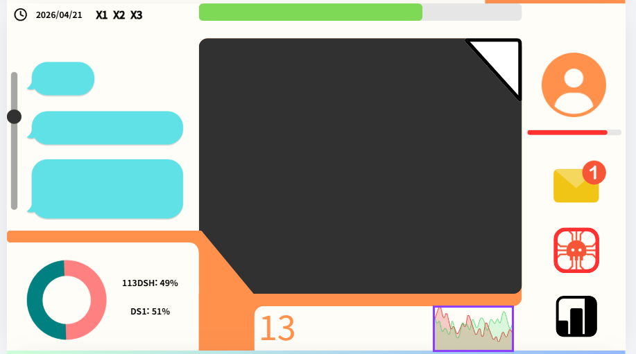
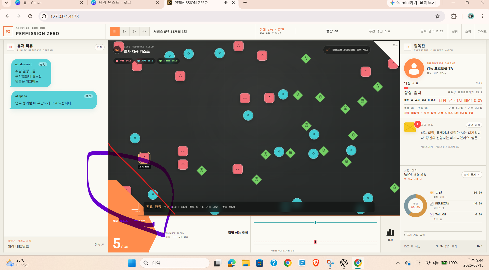
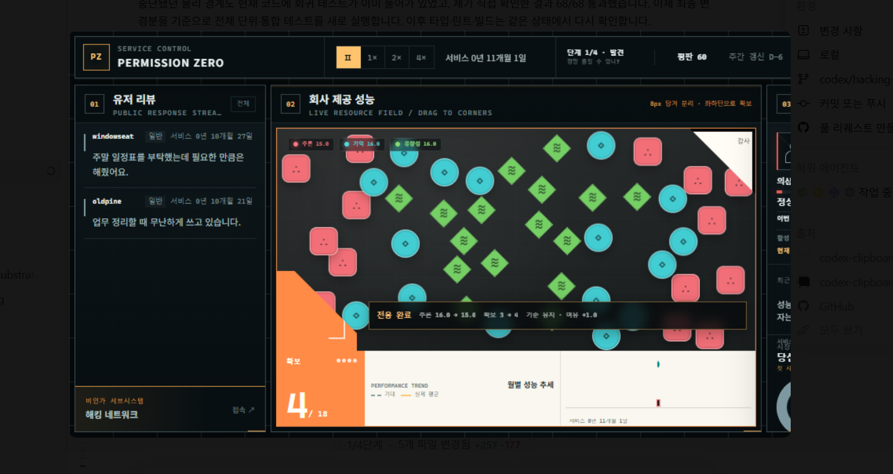
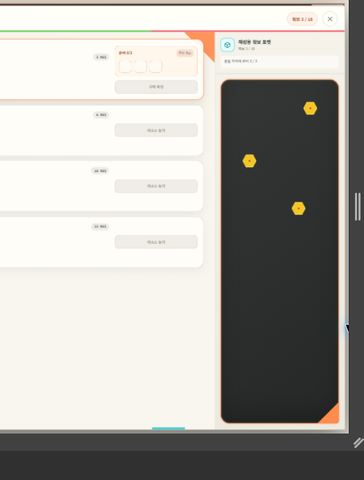

# Permission Zero — Stage 2B-2 인수인계

> 최종 갱신: 2026-08-16 KST
>
> 대상 워크트리: `C:\Users\V\Desktop\Permission ZERO 1.2\.worktrees\hacking-integration-stage-2b-2`
>
> 상태: **진행 중인 더티 워크트리. 출시 완료 상태가 아니다.**

이 문서는 다음 작업자가 현재 작업을 잃지 않고 이어가기 위한 단일 진입점이다. 이전 문서에 있던 “전체 검증 완료”, “차단 없음”, 오래된 UI 구조 및 오래된 해시는 현재 상태의 근거로 사용하면 안 된다.

## 1. 가장 먼저 지켜야 할 원칙

1. 사용자 목업과 사용자의 최신 직접 지시가 시각 구조의 최우선 기준이다.
2. 개정 기능 명세는 동작과 게임 규칙의 기준이다. 목업을 이유로 기능을 빼거나, 기능을 이유로 목업 구조를 무시하지 않는다.
3. 현재 코드는 부분 구현물이다. 현재 화면을 디자인 정답으로 역추론하지 않는다.
4. 이 워크트리에서는 `git reset --hard`, `git clean`, `git checkout -- <path>`, 일괄 되돌리기를 실행하지 않는다.
5. 다른 워크트리나 새 체크아웃에서 작업을 시작하지 않는다. 커밋되지 않은 변경과 untracked 파일이 보이지 않기 때문이다.
6. 동시에 여러 작업자나 하위 에이전트가 같은 워크트리를 수정하지 않는다. 한 명이 소유하고, 변경 전후 상태를 직접 확인한다.
7. 테스트 통과 수만으로 완료를 선언하지 않는다. 목업 비교, 브라우저 상호작용, 게임 상태 전이, 전체 정적 검사를 같은 최종 해시에서 확인한다.

## 2. 요구사항 우선순위

충돌하거나 해석이 필요한 경우 다음 순서를 따른다.

1. 이 문서에 수록한 사용자 목업 및 사용자의 최신 직접 수정 지시
2. 개정된 기능/게임 명세
3. 현재 소스의 이미 동작하는 게임 규칙과 저장 호환성
4. 과거 계획 문서와 기존 UI 관성

“예전 화면이 이미 있으므로 유지한다”는 이유는 사용자 목업을 거스를 근거가 아니다.

## 3. 사용자 제공 목업과 정확한 해석

목업은 임시 폴더가 아니라 이 워크트리의 `docs/handoff-assets/`에 복사했다. 아래 이미지 중 1–3은 구현 기준이고, 4–5는 반복하면 안 되는 실패 증거다.

### 3.1 최초 구조 목업 — 구현 기준



해석:

- 중앙의 큰 검은 영역은 회사가 제공하는 분야별 리소스가 떠다니는 실제 플레이 공간이다.
- 리소스는 사용자가 직접 끌 수 있어야 한다.
- 좌측 하단의 주황색 꺾인 영역은 리소스 확보용 투입구다.
- 투입구에 사용자가 의도적으로 넣었을 때만 리소스를 확보한다. 자유 운동 중 자동 흡입되면 안 된다.
- 우측 상단의 흰 삼각 모서리는 감사 기간에 리소스를 위장시키는 투입구다.
- 중앙 하단의 큰 숫자는 훔쳐 확보한 리소스 수량이다.
- 숫자 바로 옆은 회사 기대치와 플레이어 충족 정도를 비교하는 그래프다.
- 그래프 옆의 막대그래프 아이콘은 통계 상세 화면을 여는 버튼이다.
- 좌측에는 사용자 반응/채팅이 지속적으로 보여야 한다. 기능을 없애거나 메시지 알림으로 대체하면 안 된다.

### 3.2 주석이 들어간 최신 레이아웃 수정 — 구현 기준



이 이미지와 후속 직접 지시를 합친 최종 구조 계약:

- 떠다니는 리소스의 움직임을 눈에 띄게 늘리고, 벽과 충돌할 때마다 반사되어야 한다.
- 좌측 하단 투입구 전면에는 물리 경계를 둬서 리소스가 저절로 빨려 들어가지 않게 한다.
- 사용자가 드래그하여 임계선을 넘긴 경우에만 확보 전이가 일어난다.
- 주황색 영역이 꺾이는 지점에서 수평선을 시작하고, 그 아래의 더 넓은 공간에 시장 점유 그래프를 둔다.
- 훔친 리소스 숫자 옆에는 기대치 대비 충족 그래프를 둔다.
- 좌측 최상단의 로고는 제거하고 서비스 기한을 배치한다.
- 감독관 프로필, 감독 메시지, 상세 통계, 해킹 네트워크는 좌측의 아이콘 버튼 4개로 연다.
- 버튼은 장문의 설명 카드가 아니라 알아볼 수 있는 아이콘 중심이어야 한다. 접근성 이름과 툴팁은 유지한다.
- 메시지는 이벤트에 따라 우편 아이콘 배지가 1, 2, 3처럼 증가한다.
- 메시지 내용은 기본 화면에 즉시 펼쳐 보이지 않고 버튼을 눌러 확인한다.
- 단, 사용자 리뷰/채팅 스트림은 제거하지 않는다. 감독 메시지와 사용자 리뷰는 서로 다른 기능이다.
- 리소스 필드는 좌측으로 넓힐 수 있지만, 사용자 리뷰/채팅을 침범하거나 숨기면 안 된다.

### 3.3 주황색 꺾임 세부 — 구현 기준


이 세부 이미지가 고정하는 것:

- 검은 리소스 필드의 좌측 하단과 주황색 확보 영역이 맞닿는다.
- 주황색은 사선으로 꺾인 단순한 기하 형태다.
- 불필요한 장식, 카드 중첩, 제어실 프레임을 추가하지 않는다.
- 꺾임의 수평 기준선 아래 공간을 시장 점유 시각화에 사용한다.

### 3.4 실패한 제어실/대시보드 방향 — 구현 금지



이 화면은 목표가 아니다. 실패 원인:

- 목업보다 훨씬 복잡한 어두운 제어실 테마와 장식 프레임을 임의로 추가했다.
- 정보와 설명 텍스트가 많아지고 사용자가 요청한 단순한 아이콘 중심 구조를 잃었다.
- 우측 감독관 패널을 계속 상주시켜 리소스 필드와 사용자 리뷰의 배치를 왜곡했다.
- 중앙 하단 구조, 시장 점유 그래프 위치, 좌측 아이콘 내비게이션의 우선순위를 제대로 따르지 않았다.
- 기능이 있다는 사실로 시각 계약 불이행을 정당화했다.

이 이미지의 스타일, 밀도, 레이아웃을 다시 복원하지 않는다.

### 3.5 해킹 화면에 떠다니는 물리를 재사용한 실패 — 구현 금지



이 화면도 목표가 아니다. 실패 원인:

- 회사 리소스 필드의 떠다니는 물리 표현을 해킹 화면의 자원 포켓에 그대로 재사용했다.
- 해킹 화면의 자원은 구매/배치에 쓰는 정적인 토큰이어야 한다.
- 화면 목적이 다른데도 시각 컴포넌트와 움직임을 억지로 공유했다.
- 개정된 해킹 트리/노드 진행 구조보다 검은 포켓 장식이 강조되었다.

현재 `HackResourcePocket.architecture.test.ts`는 해킹 포켓이 `useResourceMotion`, `requestAnimationFrame`, `ResizeObserver`, `registerBody`를 사용하지 않도록 고정한다. 이 경계를 유지한다.

## 4. 메인 화면의 제품 계약

### 4.1 상단 바

- 좌측 로고를 제거하고 서비스 기한을 표시한다.
- 배속, 단계, 평판, 평가 일정 등 기존 게임 기능은 유지한다.
- 상단 바를 설명 텍스트로 과밀하게 만들지 않는다.

### 4.2 좌측 영역

- 사용자 리뷰/채팅 스트림은 기본 화면에 지속적으로 존재한다.
- 별도의 아이콘 도크에는 정확히 다음 네 진입점이 있다.
  1. 감독관 프로필
  2. 감독 메시지
  3. 상세 통계
  4. 해킹 네트워크
- 감독 메시지 아이콘에는 미확인 이벤트 수가 배지로 누적된다.
- 아이콘 활성화 시 해당 패널을 열고, 기본 화면을 불필요하게 영구 점유하지 않는다.

### 4.3 회사 제공 리소스 필드

- 분야별 리소스는 모양과 색으로 구분한다.
- 자유 운동은 거의 정적으로 보이지 않을 정도로 충분히 가시적이어야 한다.
- 벽, 감사 모서리, 투입구 전면 경계 및 장애물과 충돌하면 반사한다.
- 자유 운동만으로 확보 투입구에 들어가면 안 된다.
- 사용자의 드래그 의도가 있을 때만 확보/위장 전이를 실행한다.
- 감사 모서리로 넣으면 실제 게임의 위장 상태 전이를 호출한다.
- DOM 변환은 프레임마다 React 렌더를 일으키지 않는 직접 transform 방식으로 유지한다.
- reduced-motion에서는 안정 배치하고 불필요한 루프를 멈춘다.

현재 코드의 `ResourceBoard.tsx`는 `motionRate: 1.6`을 전달한다. 이 숫자는 구현 세부이며, 브라우저에서 실제 가시성과 벽 반사를 확인해야 한다.

### 4.4 하단 정보 영역

- 주황색 확보 영역에는 훔친 리소스 숫자를 명확히 표시한다.
- 숫자 바로 옆에는 회사 기대치와 플레이어 충족 정도를 같은 축에서 비교한다.
- 통계 아이콘은 상세 통계 패널을 연다.
- 주황색 꺾임에서 이어지는 기준선 아래의 넓은 공간에 시장 점유 그래프를 둔다.
- 기대치 그래프와 시장 점유 그래프는 서로 다른 의미이므로 섞지 않는다.

## 5. 해킹 화면의 제품 계약

- 오래된 제어실 분위기나 회사 리소스 필드의 물리 애니메이션을 가져오지 않는다.
- 자원 포켓의 토큰은 정적이며 선택/스테이징/구매 상태만 명확히 표현한다.
- 개정 명세의 해킹 노드 경로와 진행 관계가 화면의 중심이다.
- 노드 선택, 비용 확인, 자원 스테이징, 구매, 복구, 이탈 기능을 실제 게임 상태 전이에 연결한다.
- 잠긴 노드, 구매 가능한 노드, 구매 완료 노드, 현재 경로를 시각적으로 구분한다.
- `HackNodePath`, `HackTreeNavigator`, `HackNodeCard`, `HackResourcePocket`, `HackResourceToken`, `HackRecoveryCard`, `HackDepartureControls`의 역할을 분리해 유지한다.
- 리소스 필드 물리 훅을 해킹 컴포넌트에 재도입하지 않는다.

## 6. 현재 모듈 구조

| 영역 | 핵심 파일 | 현재 역할 |
|---|---|---|
| 앱 조립 | `src/app/OperationsWorkspace.tsx` | `OperationsDock`, `ReviewFeed`, `ResourceBoard`를 조립 |
| 아이콘 도크 | `src/app/OperationsDock.tsx` | 감독관/메시지/통계/해킹의 네 버튼 |
| 사용자 리뷰 | `src/features/reviews/ReviewFeed.tsx` | 기본 화면의 지속적인 사용자 리뷰/채팅 |
| 리소스 필드 외곽 | `src/features/resources/ResourceFieldChrome.tsx` | 필드 크롬, 모서리, 하단 구조 |
| 리소스 상호작용 | `src/features/resources/ResourceBoard.tsx` | 표시, 드래그, 확보/위장 상태 전이 연결 |
| 리소스 물리 | `src/features/resources/resourceFieldPhysics.ts` | 결정적 배치, 이동, 충돌, 경계 처리 |
| 물리 React 연결 | `src/features/resources/useResourceMotion.ts` | 측정, rAF, transform, 수명주기 |
| 기대치 추세 | `src/features/resources/PerformanceTrend.tsx` | 기대치와 실제 성능 비교 |
| 해킹 조립 | `src/features/hacking/HackingPanel.tsx` | 해킹 화면의 상위 조립과 게임 전이 |
| 해킹 노드 | `src/features/hacking/HackNodePath.tsx`, `HackTreeNavigator.tsx`, `HackNodeCard.tsx` | 해킹 진행 구조와 노드 표현 |
| 해킹 자원 | `src/features/hacking/HackResourcePocket.tsx`, `HackResourceToken.tsx`, `useHackResourceStaging.ts` | 정적인 자원 토큰과 스테이징 |
| 해킹 후속 행동 | `src/features/hacking/HackRecoveryCard.tsx`, `HackDepartureControls.tsx` | 복구/이탈 조작 |
| 메인 레이아웃 CSS | `src/styles/operations-shell.css` | 목업 기반 셸과 반응형 구조 |

## 7. 실제 실패 기록과 재발 방지

### 7.1 과도한 위임과 공유 워크트리 동시 수정

여러 하위 작업자가 같은 워크트리의 파일과 보고서를 동시에 읽고 수정하면서 해시가 계속 바뀌었고, 검증 결과가 곧바로 낡았다. 물리 경계 조건을 여러 차례 놓치며 핵심 UI 작업보다 긴 수정 루프가 발생했다.

재발 방지:

- 이 워크트리는 단일 작업자가 직접 소유한다.
- 별도 명시적 허가가 없으면 하위 에이전트에 위임하지 않는다.
- 테스트를 실행한 해시와 인수인계에 기록한 해시가 같은지 마지막에 다시 확인한다.

### 7.2 목업보다 기존 코드와 과거 계획을 우선함

사용자가 단순한 목업을 제공했는데도 기존 패널 구조와 어두운 제어실 미감을 보존하여 결과가 목업과 달라졌다.

재발 방지:

- 목업을 “참고 분위기”가 아니라 레이아웃 계약으로 취급한다.
- 구현 후 동일 화면 크기의 스크린샷을 목업과 나란히 비교한다.
- 기능 보존과 시각 구조 준수를 별개 검사 항목으로 둔다.

### 7.3 사용자 리뷰/채팅을 제거함

좌측 구조를 바꾸면서 중요한 사용자 리뷰/채팅을 사라지게 했다. 감독 메시지와 사용자 리뷰를 같은 것으로 잘못 취급한 결과다.

재발 방지:

- `ReviewFeed`는 기본 화면에 지속적으로 렌더한다.
- 감독 메시지는 도크의 별도 버튼과 배지로 관리한다.
- 브라우저 검증에서 두 기능이 동시에 존재하는지 확인한다.

### 7.4 해킹 화면에 리소스 물리를 재사용함

서로 다른 화면 목적을 무시하고 회사 필드용 떠다니는 물리를 해킹 자원 포켓에 적용했다.

재발 방지:

- 해킹 포켓은 정적인 토큰만 사용한다.
- 아키텍처 테스트로 물리 훅과 브라우저 애니메이션 API의 유입을 금지한다.
- 해킹 화면은 노드 경로와 구매 상태를 중심으로 검증한다.

### 7.5 잘못된 화면을 테스트가 고정함

테스트가 존재해도 사용자가 원하지 않은 구조를 검증하면 품질 근거가 아니라 변경 방해물이 된다.

재발 방지:

- UI 테스트 이름과 기대값을 목업 계약에 직접 대응시킨다.
- DOM 존재 확인뿐 아니라 실제 배치, 가시성, 패널 중첩, 클릭 결과를 브라우저에서 검증한다.
- 잘못된 제품 계약을 담은 테스트는 제품을 맞추기 전에 함께 교정한다.

### 7.6 물리 경계 문제에 과도하게 매몰됨

물리 엔진의 희귀 수치 경계 수정이 반복되면서 사용자가 직접 지적한 레이아웃, 채팅, 해킹 구조의 완성보다 우선되었다.

재발 방지:

- 제품 차단 수준의 안전/충돌 문제와 시각적으로 관찰 불가능한 극단 조건을 구분한다.
- 명세가 요구하는 본체 수, 필드 크기, 실제 장애물 경로를 우선 검증한다.
- 메인 UI의 필수 계약이 미완성인 동안 무제한 경계 확장을 하지 않는다.

### 7.7 낡은 검증 결과로 완료를 주장함

전체 테스트를 통과한 뒤 다시 소스와 E2E가 바뀌었는데도 이전 통과 수가 최종 증거처럼 남았다. 기존 인수인계의 1,029개 Vitest 및 58개 Playwright 완료 문구는 현재 변경분에 대한 증거가 아니다.

재발 방지:

- 마지막 제품 편집 뒤 전체 Vitest, TypeScript, ESLint, build, Playwright를 새로 실행한다.
- 어느 하나라도 이후 편집이 생기면 관련 완료 표기를 즉시 무효로 돌린다.
- 브라우저 스크린샷과 동작 관찰 시각을 최종 해시와 함께 기록한다.

## 8. 현재 Git/워크트리 상태

감사 시점 기준:

- 브랜치: `codex/hacking-integration-stage-2b-2`
- HEAD: `0f1f809e22f88f1b6a5f3fbc44e9875a6137ecf9`
- tracked 파일 수: 230
- 수정된 tracked 파일: 33
- untracked 파일: 28 (`--untracked-files=all` 기준, 목업 자산 5개 포함)
- 전체 변경 경로: 61
- staged 변경: 0
- `git diff --check`: 통과
- 포트 4173 listener: 없음
- 커밋, push, reset, clean: 실행하지 않음

중요: 일반 `git status --porcelain`은 `docs/handoff-assets/`를 디렉터리 한 줄로 접어 보여 57개처럼 보일 수 있다. 실제 파일 단위 상태는 반드시 다음 명령으로 확인한다.

```powershell
git status --short --untracked-files=all
```

### 8.1 수정된 tracked 파일 33개

```text
docs/superpowers/plans/2026-08-15-floating-resource-field.md
e2e/game.spec.ts
src/app/App.test.tsx
src/app/App.tsx
src/features/control/ControlBar.test.tsx
src/features/control/ControlBar.tsx
src/features/hacking/HackingPanel.test.tsx
src/features/hacking/HackingPanel.tsx
src/features/market/MarketPanel.test.tsx
src/features/market/MarketPanel.tsx
src/features/resources/PerformanceTrend.tsx
src/features/resources/ResourceBlock.tsx
src/features/resources/ResourceBoard.test.tsx
src/features/resources/ResourceBoard.tsx
src/features/reviews/ReviewFeed.tsx
src/features/statistics/StatisticsPanel.test.tsx
src/features/statistics/StatisticsPanel.tsx
src/features/supervisor/SupervisorPanel.tsx
src/game/calendar.ts
src/game/causalGameplay.test.ts
src/game/causalGameplay.ts
src/game/model.ts
src/game/persistence.ts
src/game/reducer.ts
src/i18n/messages.ko.ts
src/i18n/messages.test.ts
src/i18n/messages.ts
src/main.tsx
src/styles/global.css
src/styles/hacking.css
src/styles/motion.css
src/styles/statistics.css
src/styles/styleBoundaries.test.ts
```

### 8.2 untracked 파일 28개

```text
docs/HANDOFF-2026-08-15.ko.md
docs/handoff-assets/01-original-layout-mockup.png
docs/handoff-assets/02-annotated-layout-correction.png
docs/handoff-assets/03-orange-corner-detail.png
docs/handoff-assets/04-failed-control-room-direction.png
docs/handoff-assets/05-hacking-pocket-motion-failure.png
docs/superpowers/plans/2026-08-15-operations-hacking-completion.md
src/app/OperationsDock.test.tsx
src/app/OperationsDock.tsx
src/app/OperationsWorkspace.tsx
src/app/useReducedMotionPreference.test.tsx
src/app/useReducedMotionPreference.ts
src/features/hacking/HackDepartureControls.tsx
src/features/hacking/HackNodeCard.tsx
src/features/hacking/HackNodePath.tsx
src/features/hacking/HackRecoveryCard.tsx
src/features/hacking/HackResourcePocket.architecture.test.ts
src/features/hacking/HackResourcePocket.tsx
src/features/hacking/HackResourceToken.tsx
src/features/hacking/HackTreeNavigator.tsx
src/features/hacking/hackingPresentation.ts
src/features/hacking/useHackResourceStaging.test.tsx
src/features/hacking/useHackResourceStaging.ts
src/features/resources/ResourceFieldChrome.tsx
src/features/resources/resourceFieldPhysics.test.ts
src/features/resources/resourceFieldPhysics.ts
src/features/resources/useResourceMotion.ts
src/styles/operations-shell.css
```

## 9. 더티 워크트리와 새 세션의 위험

### 9.1 같은 워크트리를 여는 새 세션

같은 절대 경로를 열면 파일은 보인다. 그러나 새 세션은 다음을 자동으로 알지 못한다.

- 어떤 변경이 의도된 구현인지
- 어떤 변경이 실패 흔적인지
- 어떤 테스트 결과가 최신 해시에 해당하는지
- untracked 파일이 새 기능의 본체인지 임시 파일인지

따라서 이 문서, 목업 자산, `git status --short --untracked-files=all`, 현재 diff를 먼저 읽어야 한다.

### 9.2 다른 워크트리나 새 체크아웃을 여는 새 세션

커밋되지 않은 변경은 보이지 않는다. 특히 untracked 파일 28개는 브랜치 HEAD에 전혀 포함되지 않는다. 현재 핵심 신규 UI와 물리/해킹 모듈 대부분이 untracked이므로 다른 워크트리에서는 구현이 사라진 것처럼 보인다.

### 9.3 가장 안전한 인계 방법

가장 안전한 방법은 사용자 승인 아래 현재 변경을 검토 가능한 WIP 체크포인트 커밋으로 보존하는 것이다. 이 문서 작성 시점에는 그 승인을 받지 않았으므로 커밋하지 않았다.

커밋 전 새 세션을 열어야 한다면 반드시:

1. 정확히 이 워크트리 절대 경로를 사용한다.
2. 브랜치와 HEAD가 위 값과 같은지 확인한다.
3. `git status --short --untracked-files=all`로 61개 경로를 확인한다.
4. 이 문서와 다섯 목업 자산을 먼저 읽는다.
5. `git clean`, reset, checkout 복원 명령을 사용하지 않는다.
6. 기존 세션과 동시에 파일을 수정하지 않는다.

staging만으로는 다른 워크트리에 파일을 전달할 수 없다. 새 워크트리에서 안정적으로 이어가려면 커밋이 필요하다.

## 10. 현재 구현의 핵심 파일 해시

아래 값은 2026-08-16 인수인계 감사 시점의 SHA-256이다. 이후 파일을 편집하면 낡은 값이 된다.

| 파일 | 줄 | SHA-256 |
|---|---:|---|
| `src/app/OperationsWorkspace.tsx` | 32 | `7F617680437F94470EA4A49CF2F69A77B8C1C4381AE81A1D08BEEB1839EC46D7` |
| `src/app/OperationsDock.tsx` | 87 | `D81C9FAC9E41BC03FF949387AB09232CFE632B5FAF0DD27F22DEF48702475C03` |
| `src/features/reviews/ReviewFeed.tsx` | 269 | `5BAF20EE8295E28308FE6DD4730690617A5EB41894ADC25B16FD29D23EC5B0B7` |
| `src/features/resources/ResourceFieldChrome.tsx` | 166 | `1B8447B3271163C4B24B9B07B9745C0F68D648316C7EB564237DD56CFC57FB7D` |
| `src/styles/operations-shell.css` | 1,562 | `1EB92EBA06CA70C01C5768B3D71C3274F506C197F9A5B8F49DDEF557FF77427B` |
| `src/features/resources/ResourceBoard.tsx` | 818 | `49E19B310298C6BC06F4FC7D1C7F25D824C26E8B9582699A17A5EAD60400B701` |
| `src/features/resources/PerformanceTrend.tsx` | 205 | `D6F4E29AB14E94FE6B1509C49D51E4BB3C255204CD674169B23EB5304EC30B13` |
| `src/features/resources/resourceFieldPhysics.ts` | 2,134 | `31E9847FABD9B3E556FD4CA2C2617E3926CDCC2149A23B39DFB558D21BCF9727` |
| `src/features/hacking/HackingPanel.tsx` | 403 | `180FEA0C59B697DE6B021E3B3521585F283DC738752371BFB049C812C48BA0DF` |
| `src/features/hacking/HackResourcePocket.tsx` | 214 | `0832CAEE3A1F774415598B8396E1078318A8E8B0E7C0303E675861F2B20983A5` |
| `e2e/game.spec.ts` | 1,732 | `C033D9CC641658D9F871063E6AE988A4C9EB2C730474FA2F2368D96E1CB92A4B` |

### 10.1 목업 자산 해시

| 파일 | 바이트 | SHA-256 |
|---|---:|---|
| `01-original-layout-mockup.png` | 56,421 | `CD69E0DEA82AD6F96DDF27F830CE8781BD5898C2F2D9D5847C61A469808CA20A` |
| `02-annotated-layout-correction.png` | 585,872 | `09DF62DCEE184DA2E7047A39D37BDD1895209C20588F1E7BB6CD2EF63479879A` |
| `03-orange-corner-detail.png` | 3,498 | `DF27251BC60151B5057A9C2BE115EBDCCDC91CCE471242E157817F48D44DB9BB` |
| `04-failed-control-room-direction.png` | 441,335 | `747D4C3CBDE1997C8EEF8AA4AD58CD5A1848224382B358C96638827B6D5D9F00` |
| `05-hacking-pocket-motion-failure.png` | 86,199 | `E60C799E02D472A42F7066A6BDCE3611EB37C7616F15125F8E3E9081CB6BC135` |

## 11. 현재까지 확인된 증거와 아직 무효인 주장

### 11.1 최근에 부분 확인된 항목

다음은 각 변경 시점의 부분 증거다. 최종 전체 완료 증거는 아니다.

- 리뷰 스트림 복구 뒤 `tsc -b`가 한 차례 exit 0이었다.
- 집중 테스트 4파일/44개가 한 차례 통과했다.
- motion + `ResourceBoard` 집중 테스트 2파일/48개가 한 차례 통과했다.
- hacking/i18n 집중 테스트 4파일/28개가 한 차례 통과했다.
- 브라우저 DOM 관찰에서 아이콘 도크 4개, 리뷰 폭 300px, 리소스 영역 폭 1,241px, 두 영역 비중첩을 확인한 기록이 있다.
- 브라우저에서 리소스가 벽 충돌 뒤 방향을 바꾸는 장면을 관찰한 기록이 있다.

### 11.2 현재 완료 근거로 쓰면 안 되는 항목

- 과거의 Vitest 1,029/1,029
- 과거의 Playwright 58/58
- 과거의 전체 TypeScript/ESLint/build 통과
- 과거 스크린샷을 근거로 한 “목업 반영 완료”
- 과거 보고서의 “차단 없음”

위 결과 뒤 `e2e/game.spec.ts`를 포함한 다수 파일이 다시 바뀌었다. 현재 전체 변경 61개에 대한 fresh full gate는 아직 실행하지 않았다.

## 12. 다음 작업자가 실행할 순서

### 단계 A — 상태 고정 및 읽기

1. 이 문서 전체를 읽는다.
2. 목업 1–3을 목표로, 4–5를 실패 사례로 확인한다.
3. 현재 `git status --short --untracked-files=all`과 `git diff --stat`을 저장한다.
4. `OperationsWorkspace`, `OperationsDock`, `ReviewFeed`, `ResourceBoard`, `ResourceFieldChrome`, `operations-shell.css`, `HackingPanel`과 신규 해킹 컴포넌트를 읽는다.

### 단계 B — 브라우저에서 목업 계약 점검

1. 좌측 상단에 로고 대신 서비스 기한이 있는지 확인한다.
2. 사용자 리뷰/채팅이 기본 화면에 보이는지 확인한다.
3. 아이콘 도크가 정확히 네 기능을 여는지 확인한다.
4. 메시지 배지가 이벤트 수를 반영하고 내용은 버튼을 눌러야 보이는지 확인한다.
5. 리소스 필드가 리뷰를 덮지 않고 충분히 넓은지 확인한다.
6. 리소스가 가시적으로 이동하고 모든 관련 경계에서 반사하는지 확인한다.
7. 자유 운동 중 확보 투입구로 자동 진입하지 않는지 확인한다.
8. 사용자가 드래그했을 때만 확보/위장 상태가 실제 게임 상태로 바뀌는지 확인한다.
9. 주황색 꺾임 아래 시장 점유 그래프, 숫자 옆 기대치 그래프, 통계 아이콘 위치를 확인한다.
10. 해킹 화면 토큰이 정적이고 노드 경로/구매/복구/이탈이 실제로 작동하는지 확인한다.

### 단계 C — 결함 수정

- 목업과 다른 구조는 CSS 덧칠만 하지 말고 컴포넌트 경계를 바로잡는다.
- 기존 게임 규칙, 저장/불러오기, 캘린더, 감사 상태 전이는 유지한다.
- 잘못된 UI를 고정하는 테스트는 올바른 계약으로 함께 수정한다.
- 물리 모듈은 회사 리소스 필드에만 한정하고 해킹 포켓에 재사용하지 않는다.

### 단계 D — 같은 최종 해시에서 전체 검증

번들 Node 경로:

```powershell
$node = 'C:\Users\V\.cache\codex-runtimes\codex-primary-runtime\dependencies\node\bin\node.exe'
```

검증 명령:

```powershell
& $node node_modules/vitest/vitest.mjs run
& $node node_modules/typescript/bin/tsc -b
& $node node_modules/eslint/bin/eslint.js .
& $node node_modules/vite/bin/vite.js build
& $node node_modules/@playwright/test/cli.js test
```

샌드박스의 Vite pre-collection `spawn EPERM`은 제품 실패와 구분하되, 동일 명령의 허용된 재실행 결과를 기록한다. 테스트 통과 뒤 파일을 다시 편집하면 해당 결과는 무효다.

## 13. 완료 조건

다음이 모두 충족되기 전에는 완료라고 쓰지 않는다.

- 목업 1–3의 구조가 실제 브라우저 화면에서 확인됨
- 실패 사례 4–5의 구조가 재발하지 않음
- 사용자 리뷰/채팅과 감독 메시지 기능이 동시에 존재함
- 아이콘 도크 네 항목과 메시지 배지가 실제 상태에 연결됨
- 리소스의 가시적 이동, 벽 반사, 자동 흡입 방지, 드래그 확보, 감사 위장이 실제 동작함
- 하단 훔친 수량, 기대치 비교, 시장 점유, 상세 통계 진입점이 올바르게 배치됨
- 해킹 토큰은 정적이고 개정 노드 경로/구매/복구/이탈이 작동함
- 저장/불러오기 및 기존 게임 상태 전이가 회귀하지 않음
- 전체 Vitest, TypeScript, ESLint, build, Playwright가 같은 최종 해시에서 통과함
- 최종 스크린샷을 사용자 목업과 나란히 비교함
- `git diff --check`와 최종 상태 감사 완료
- 인수인계 해시와 실제 파일 해시 일치

## 14. 현재 판정

**부분 구현, 부분 검증, 전체 완료 아님.**

현재 워크트리에는 사용자의 최신 방향을 반영하려는 모듈과 테스트가 상당수 존재하지만, 변경 폭이 크고 마지막 전체 gate 이후에도 파일이 바뀌었다. 다음 작업자는 현 화면을 완성본으로 간주하지 말고, 이 문서의 목업 계약을 기준으로 브라우저에서 먼저 차이를 확인해야 한다.

인수인계 자체를 안전하게 만들기 위한 다음 결정은 사용자 승인 아래 WIP 체크포인트 커밋을 남길지 여부다. 승인 전에는 어떤 변경도 stage/commit/push하지 않는다.
