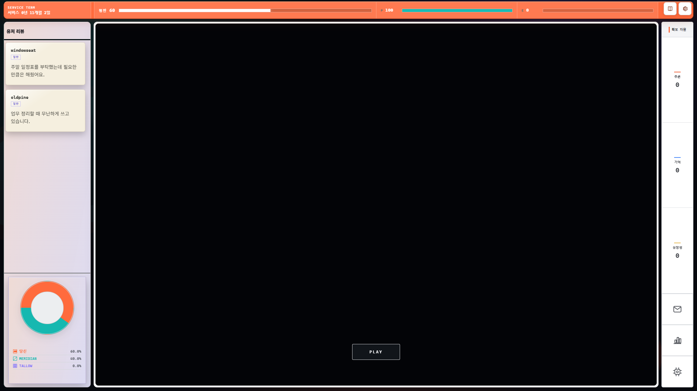
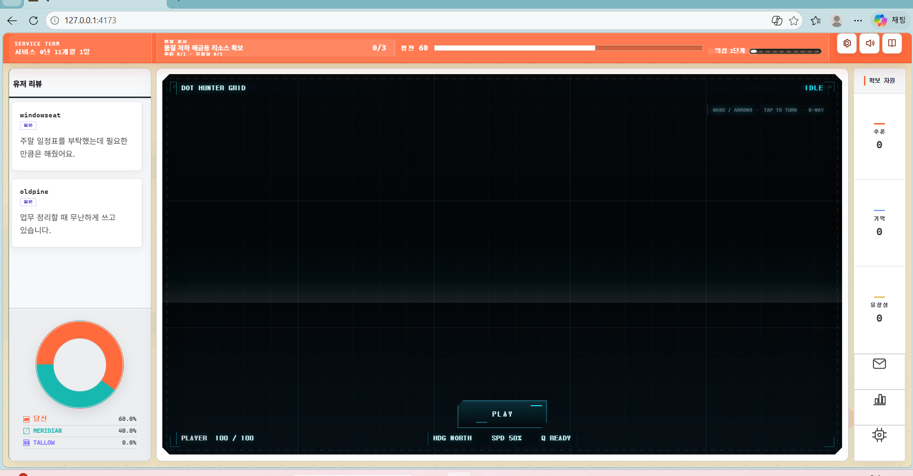

# PERMISSION ZERO — 직속 후임 인수인계서

> 작성 시각: 2026-08-22 KST  
> 선임 세션: 현재 `codex/playable-snake-checkpoint-20260821` 작업 세션  
> 대상: 이 세션을 바로 이어받는 단일 후임 세션  
> 현재 작업 경로: `C:\Users\V\Desktop\Permission ZERO 1.2`  
> 현재 브랜치 / HEAD: `codex/playable-snake-checkpoint-20260821` / `df1b962`  
> 상태: **승인 UI 미통합 회귀 확인 · AI는 플레이 가능하지만 미완성 · 전체 완료 아님**

이 문서는 요약 메모가 아니라 후임 세션의 단일 진입점이다. 후임은 제품 코드를 수정하기 전에 이 문서 전체, 현재 Git 상태, 아래 두 비교 이미지를 먼저 확인한다.

## 1. 결론과 우선순위

현재 우선순위는 다음과 같다.

1. **P0 — 사용자가 승인한 기본 UI를 현재 AI 작업 트리에 정확히 통합한다.**
2. **P0 — 시작 전 화면에서 게임 내부 격자·HUD를 숨기고, 진입 버튼 문구를 정확히 `InIt`으로 바꾼다.**
3. **P1 — 사용자가 직접 플레이해서 “나름 무난하지만 아직 제대로는 아니다”라고 판정한 적 AI를 계속 개선한다.**
4. **P2 — 목표에 가까워진 뒤에만 50개 고유 시드 × 최대 80초 최종 검증을 실행한다.**

테스트 숫자를 채우는 것이 목표가 아니다. 실제 목표는 다음 두 문장이다.

- 화면은 사용자가 승인한 UI와 일치해야 한다.
- 적 AI는 스스로 죽지 않으면서도 사람이 보기에 읽을 수 있고, 게임용으로 적절해야 한다.

## 2. 사용자의 최신 직접 판정

최신 사용자 판정은 다음과 같다.

- 현재 `4173` 화면은 승인한 화면이 아니다.
- 진입 문구는 `Start`나 `PLAY`보다 **`InIt`**이 좋다.
- AI는 “나름 무난하다.”
- 그러나 AI는 “아직 제대로는 아니다.”
- 이 세션의 후임은 현재 세션을 선임으로 삼아 직접 이어받아야 한다.

따라서 후임은 현재 화면이나 현재 테스트를 정답으로 역추론하면 안 된다. 사용자의 승인 화면과 최신 직접 판정이 최우선 기준이다.

`InIt`의 대소문자는 사용자가 적은 그대로 보존한다. 후임이 임의로 `INIT`, `Init`, `START`, `PLAY`로 정규화하지 않는다. 접근성 이름과 보이는 글자도 같은 `InIt`을 사용한다. 사용자가 이후 다른 표기를 명시하면 그때 바꾼다.

## 3. 화면 비교 증거

### 3.1 승인된 UI — 목표



- 파일: `docs/handoff-assets/06-approved-ui-freeze-2026-08-22.png`
- SHA-256: `0C10B5CF334C2EB3191037EA54C7AECC6B5D93B886EFEE49729CF11B538B51F5`
- 원본: `C:\Users\V\.codex\worktrees\1caa\Permission ZERO 1.2\output\playwright\final-freeze-1920x1080.png`

이 화면에서 고정된 핵심 구조:

- 상단 주황 바는 화면에서 미세하게 인셋되어 있고 다른 패널과 같은 라운드 체계를 가진다.
- 상단에는 서비스 기한, 평판, `P`, `E`, 지도와 설정 진입점이 있다.
- 의심 단계와 장문의 현재 지시 영역은 없다.
- 상단 비율은 평판 50%, 플레이어 체력 25%, 적 체력 25% 구조다.
- 좌측은 사용자 리뷰와 도넛 차트다.
- 중앙은 얇은 흰 외곽선을 가진 큰 흑색 플레이 프레임이다.
- 시작 전 중앙 내부는 거의 완전한 검정이며, 게임 내부 HUD나 조작 도움말이 노출되지 않는다.
- 우측 도크는 폭 88px이며 자원 세 구획은 같은 높이다.
- 우측 하단에는 메시지·통계·해킹 버튼 세 개가 모두 보인다.
- 외부 프레임과 캔버스의 위치·크기는 시작 전후 동일하다.
- 캔버스 고유 좌표계는 `1000×480`이다.

### 3.2 현재 회귀 화면 — 반복 금지



- 파일: `docs/handoff-assets/07-current-ui-regression-2026-08-22.png`
- SHA-256: `4D51C014753214E496FF80C6A7C7D79E80D9BEEF869E8BECE440F1F101DAC9B8`
- 원본: `C:\Users\V\AppData\Local\Temp\codex-clipboard-2d9715fc-a7bb-40d1-8f94-6eaae2c52950.png`

현재 화면에서 확인된 회귀:

- 상단에 승인안에 없던 `현재 지시`와 `의심 1단계`가 다시 나타난다.
- 중앙 시작 전 화면에 `DOT HUNTER GRID`, `IDLE`, `PLAYER`, `HDG`, `SPD`, `Q READY`가 노출된다.
- 시작 전부터 격자, 모서리 장식, 조작 도움말이 보인다.
- 승인된 단순 흑색 대기 화면보다 게임 내부 장식이 우선한다.
- CTA가 `PLAY`로 남아 있다.

이 화면은 “게임 화면이 멋있으니 유지해도 되는 변형”이 아니다. 사용자가 직접 승인 화면이 아니라고 판정한 회귀다.

## 4. UI가 통합되지 않은 실제 원인

승인 UI는 현재 작업 트리가 아니라 별도 작업 트리에 **커밋되지 않은 변경**으로 남아 있다.

- 승인 UI 원본 작업 트리: `C:\Users\V\.codex\worktrees\1caa\Permission ZERO 1.2`
- 원본 작업 트리 HEAD: `bc094bf`
- 관련 ref: `codex/hacking-dialogue-review-parallel`
- 현재 AI 작업 트리 HEAD: `df1b962`
- 공통 merge-base: `b4bdf0eaf974d5b225f202e551268c7728ea1447`

두 브랜치는 공통 기준점 이후 서로 갈라졌다.

```text
df1b962  current AI branch
  ... seven lightcycle commits
  |
b4bdf0e  common base
  |
bc094bf  hacking/review branch ref
```

따라서 다음 방식은 금지한다.

- 승인 UI 작업 트리의 전체 파일을 현재 작업 트리에 덮어쓰기
- `bc094bf` 하나만 체리픽하면 승인 UI까지 들어온다고 가정하기
- 현재 dirty 작업 트리를 reset/clean/checkout으로 정리하기
- 승인 UI의 CSS만 복사하고 컴포넌트 계약은 그대로 두기

승인 UI는 `bc094bf` 위의 미커밋 파일에 있다. 반면 현재 AI는 `b4bdf0e` 이후 별도의 여러 라이트사이클 커밋과 미커밋 패치를 가진다. 후임은 **선별적인 수동 통합**을 해야 한다.

## 5. 승인 UI 원본 파일 목록

다음 11개 파일이 승인 UI의 핵심 원본이다.

```text
src/app/App.tsx
src/app/App.test.tsx
src/app/OperationsDock.tsx
src/app/OperationsDock.test.tsx
src/app/OperationsWorkspace.tsx
src/features/control/ControlBar.tsx
src/features/control/ControlBar.test.tsx
src/features/control/useResourceSnakeVitals.ts
src/features/control/useResourceSnakeVitals.test.tsx
src/styles/retro-modern-remodel.css
src/styles/styleBoundaries.test.ts
```

현재 작업 트리와 SHA-256 앞 12자 비교 결과:

| 파일 | 승인 원본 | 현재 | 상태 |
|---|---|---|---|
| `src/app/App.tsx` | `A4637E1C2DA4` | `1056BC214164` | 다름 |
| `src/app/App.test.tsx` | `A488658D8128` | `1FAFE4561E48` | 다름 |
| `src/app/OperationsDock.tsx` | `097B91E61481` | `63AE9C1A8DD5` | 다름 |
| `src/app/OperationsDock.test.tsx` | `E84876D6FBCD` | `361F5694B20C` | 다름 |
| `src/app/OperationsWorkspace.tsx` | `3754FC63C4E0` | `E00400003B1A` | 다름 |
| `src/features/control/ControlBar.tsx` | `F422D69E5349` | `0DF525BB108C` | 다름 |
| `src/features/control/ControlBar.test.tsx` | `0E98FFE9D052` | `82D0AFE0DE9B` | 다름 |
| `src/features/control/useResourceSnakeVitals.ts` | `366F514B3103` | 없음 | 신규 포팅 필요 |
| `src/features/control/useResourceSnakeVitals.test.tsx` | `2C33E80163F8` | 없음 | 신규 포팅 필요 |
| `src/styles/retro-modern-remodel.css` | `B8D3F6BE2BE6` | `3EC6ED48951A` | 다름 |
| `src/styles/styleBoundaries.test.ts` | `CF1B32814377` | `3E3643068930` | 다름 |

승인 작업 트리에는 이와 별개로 리뷰 콘텐츠 변경도 있다.

```text
src/content/reviews.ko.ts
src/content/reviews/
src/game/reviews.ts
src/game/reviews.test.ts
```

이 리뷰 변경은 UI 포팅과 한 덩어리로 덮어쓰지 않는다. 현재 작업 트리의 해킹·대사·리뷰 변경과 중복될 수 있으므로 별도 diff로 판정한다.

## 6. 시작 전 화면 회귀의 추가 원인

승인 UI 셸만 포팅해도 중앙 대기 화면 회귀가 자동으로 해결되지는 않는다. 현재 AI 브랜치의 `src/features/resources/ResourceSnakeBoard.tsx`가 시작 전에도 게임 내부 표현을 항상 렌더링하기 때문이다.

현재 코드의 핵심:

- 캔버스는 `idle`에서도 항상 렌더링된다: 약 578–637행.
- HUD는 `idle`에서도 항상 렌더링된다: 약 638–655행.
- 버튼은 `idle`과 `deploying`에서 렌더링된다: 약 656–671행.
- 버튼의 보이는 글자와 접근성 이름이 모두 `PLAY`다.
- `resourceSnakeCanvas`는 idle 상태에도 산업 격자 장면을 그린다.

후임이 구현해야 할 상태 계약:

| 상태 | 중앙 내부 표현 | CTA |
|---|---|---|
| `idle` | 승인 화면과 같은 깨끗한 흑색 대기 화면. 내부 HUD·격자·조작 도움말 숨김 | `InIt` 표시 |
| `deploying` | 프레임 크기는 그대로. 필요한 배치 전환만 표시 | `InIt` disabled 또는 승인된 배치 피드백 |
| `active` | 현재 라이트사이클 캔버스, 읽을 수 있는 HUD, 조작 피드백 표시 | CTA 숨김 |
| `resolving` | 전투 결과 표현 유지 | CTA 숨김 |

중요: 게임 내부 디자인을 삭제하라는 뜻이 아니다. **승인된 대기 화면과 실제 전투 화면의 노출 시점을 분리**하라는 뜻이다.

CTA 변경 시 함께 수정해야 할 현재 검색 결과:

```text
src/features/resources/ResourceSnakeBoard.tsx
src/features/resources/ResourceSnakeBoard.test.tsx
e2e/resource-snake.ts
e2e/game.spec.ts
e2e/modern-sf.spec.ts
```

테스트 이름, 접근성 selector, 튜토리얼 문구에 남은 `PLAY`도 실제 사용자 계약에 맞춰 수정한다. 단순 문자열 전역 치환으로 `PLAYER` 같은 다른 단어를 훼손하지 않는다.

## 7. UI 통합 시 파일 소유 경계

현재 작업 트리는 깨끗하지 않다. 인수인계 작성 직전 기준:

- 수정된 tracked 파일: 30개
- untracked 파일: 33개
- staged 파일: 0개
- 커밋·push·reset·clean 실행 안 함

현재 변경은 사용자의 작업과 이 세션의 AI 작업이 함께 존재한다. 전부 보존한다.

절대 금지:

- `git reset --hard`
- `git clean`
- `git checkout -- <path>`
- `git add .`
- `git add -A`
- 현재 변경 전체를 임의로 포맷하거나 정리하기
- 승인 UI 원본 작업 트리의 파일을 통째로 복사해 현재 AI 파일을 덮어쓰기

특히 충돌 가능성이 높은 파일:

- `src/app/App.tsx`: 패널, 런타임, 체력 연결이 모이는 셸
- `src/app/App.test.tsx`: 현재 작업 트리에서도 이미 수정됨
- `src/styles/retro-modern-remodel.css`: 전체 레이아웃 우선순위
- `e2e/game.spec.ts`, `e2e/modern-sf.spec.ts`: UI와 전투 기대값이 함께 있음
- `src/features/resources/ResourceSnakeBoard.tsx`: AI 런타임과 시작 전 표현이 만나는 곳

UI 통합 중 다음 AI 핵심 파일은 승인 UI 원본으로 대체하지 않는다.

```text
src/features/resources/resourceSnakeAiController.ts
src/features/resources/resourceSnakeRuntime.ts
src/features/resources/resourceSnakePlanner.ts
src/features/resources/resourceSnakeTrajectory.ts
src/features/resources/resourceSnakeCanvas.ts
src/features/resources/resourceSnakePresentation.ts
src/features/resources/resourceSnakeCyanProfile.ts
src/features/resources/resourceSnakeEncounter.ts
```

## 8. 승인 UI의 상세 계약

승인 작업 세션이 남긴 검증 계약은 다음과 같다. 이 수치는 새 통합 뒤 다시 측정해야 하며, 과거 결과를 현재 통합 결과로 재사용하면 안 된다.

### 상단 바

- 화면 가장자리에서 미세하게 인셋한다.
- 다른 패널과 같은 라운드 체계를 유지한다.
- 의심 수치와 의심 문구는 제거한다.
- 평판 50% / 플레이어 체력 25% / 적 체력 25% 비율을 유지한다.
- 플레이어·적 표시는 각각 `P`, `E`다.
- 실제 게임 체력 상태와 연결한다.

### 좌측

- 사용자 리뷰와 도넛 영역만 승인된 차트 계열 배경색을 사용한다.
- 리뷰 메시지 박스는 연한 아이보리를 유지한다.
- 기존 검은 부분과 스크롤 막대에 차트 배경색을 확장하지 않는다.
- 좌측 폭을 키워 중앙 게임 면적을 침범하지 않는다.

### 중앙

- 흑색 플레이 프레임과 얇은 흰 외곽선을 유지한다.
- `InIt` 전후 외부 프레임과 내부 캔버스 면적은 동일하다.
- 캔버스 고유 좌표계는 `1000×480`이다.
- 게임 좌표계, 충돌 경계, 종횡비, 실제 플레이 면적을 바꾸지 않는다.
- 시작 전에는 내부 게임 HUD를 숨긴다.

### 우측 88px 도크

- `확보 자원` 제목을 유지한다.
- 추론·기억·유창성 구획은 세로로 같은 높이다.
- 메시지·통계·해킹 버튼 세 개를 모두 노출한다.
- 각 버튼은 약 `86×86px`, 아이콘은 중앙 정렬한다.
- 버튼 사이에는 얇은 구분선만 둔다.
- 긴 자원 라벨이나 큰 수치가 하단 도구 영역을 밀어내면 안 된다.
- 도크 폭을 늘려 중앙 게임 면적을 줄이지 않는다.

### 우측 버튼 접근성

```text
메시지: aria-label/title = "감독 메시지 열기"
통계:   aria-label/title = "상세 통계 열기"
해킹:   aria-label/title = "해킹 네트워크 열기"
```

- 키보드 탭 포커스 가능
- `:focus-visible` 외곽선 표시
- 호버 상태 표시
- 선택한 도구만 `aria-pressed="true"`
- 패널을 닫으면 모두 `aria-pressed="false"`
- 각 버튼은 정확한 패널을 열어야 함

### 과거 승인 측정값

| 해상도 | 페이지 스크롤 | 우측 도크 | 중앙 프레임 | 판정 |
|---|---|---|---|---|
| 1366×650 | 없음 | 88×580 | 1002×580 | 잘림·겹침 없음 |
| 1280×720 | 없음 | 88×650 | 925.61×650 | 잘림·겹침 없음 |
| 1440×900 | 없음 | 88×830 | 1076×830 | 잘림·겹침 없음 |
| 1920×1080 | 없음 | 88×1010 | 1556×1010 | 잘림·겹침 없음 |

1920×1080에서 과거 승인 측정:

```text
중앙 외부 프레임: x258, y60, 1556×1010
내부 캔버스 표시: x264, y66, 1544×998
캔버스 고유 크기: 1000×480
```

후임은 이 값을 새 통합 브라우저에서 다시 측정한다. 브라우저 서브픽셀 차이는 허용하지만 구조 차이는 허용하지 않는다.

## 9. 현재 AI의 제품 상태

사용자 최신 판정은 “나름 무난하지만 아직 제대로는 아니다”다. 이것이 자동 테스트보다 높은 제품 판정이다.

현재 유지해야 할 방향:

- 스네이크 게임과 유사한 계속 전진하는 플레이
- 8방향 입력
- 평면 탑뷰
- 트론과 민더스트리 사이의 분위기
- 청록 단일 적 테마
- 도트 기반 몸체와 빛나는 궤적
- 화살표 머리 금지; 둥글거나 네모난 머리
- 시작부터 과도하게 빠르지 않은 속도
- 게임용으로 읽을 수 있는 방향 전환
- 적이 자기 궤적·경계·아군 때문에 자살하지 않음

현재 실제 속도 설정:

```text
openingSpeedScale: 0.50
maximumRoundSpeedScale: 0.75
speedRampMs: 30_000
```

즉 배치가 끝난 뒤 50%에서 시작해 30초 동안 75%까지 선형으로 오른다.

현재 방향 전환 관련 설정:

```text
프로필 minimumHeadingHoldMs: 900 / 800 / 700
enemyNormalTurnWindowMs: 2_000
enemyMaximumNormalTurnsPerWindow: 2
enemyEmergencyCooldownMs: 2_000
enemyEmergencyLockMs: 900
enemyEmergencyCorrectionHoldMs: 350
enemyReturnHeadingLockMs: 1_400
```

이는 모든 방향 전환을 무조건 2초에 한 번으로 제한한 구현이 아니다. 정상 방향 전환은 프로필별 700–900ms 유지와 2초 구간 최대 2회 제한을 받고, 긴급 회피는 별도 2초 쿨다운과 교정 규칙을 가진다. 사용자가 여전히 “제대로는 아니다”라고 했으므로, 후임은 실제 플레이 관찰을 통해 어느 행동이 문제인지 먼저 재현해야 한다.

## 10. 현재 AI에서 유지할 핵심 수정

현재 작업 트리에 남아 있고 핵심 단위 테스트가 통과한 방향:

- 플래너가 광고한 첫 회전 시점과 런타임 실행 시점 정렬
- 정상 계획과 런타임 방향 전환을 최대 90도 범위로 제한
- 현재 머리 아래의 자기 궤적 보수 반경 때문에 출발부터 가짜 충돌로 판정되는 문제 수정
- 플레이어와 아군의 움직이는 머리를 안전성 계산에 포함
- 안전 fallback의 회복 방향을 90도 이내로 제한
- 런타임 긴급 안전성 판단을 쿨다운 전체 구간까지 확장
- 쿨다운이 남아 있을 때 계획된 안전 경로가 간극을 연결할 수 있도록 처리
- 만료된 회복 계획을 거부하고 현재 상태와 회복 heading을 다시 동기화
- 자기 충돌·경계 충돌·아군 충돌을 구분하여 진단
- 사망 시뮬레이션을 즉시 중단하고 중단 지연을 0으로 측정하는 장기 harness

이 항목들은 “최종 완성”이 아니라 현재 유지 가능한 기반이다.

## 11. 반복하지 말아야 할 AI 실패 접근

### 11.1 짧은 시간으로 장기 생존을 가장하는 테스트

- 과거 1.15초 또는 12초 테스트를 장기 생존 증거처럼 사용한 방식은 금지한다.
- 짧은 targeted test는 특정 충돌 원인을 재현하는 용도로만 사용한다.
- 80초 목표를 짧은 테스트 통과 수로 대체하지 않는다.

### 11.2 실행 횟수로 품질을 가장하기

- 750회 실행을 품질 증거로 삼지 않는다.
- 사용자가 승인한 최종 gate는 50개 고유 시드다.
- 테스트 수보다 각 테스트가 실제 결함을 발견하거나 막는지가 중요하다.

### 11.3 첫 명령 유지 안전성 필터

최근 실험한 “첫 명령이 런타임 hold 전체를 생존해야 후보를 허용”하는 필터는 제거됐다.

관측 결과:

- 유지 가능한 기준: 10개 중 6개 완료
- 해당 필터 적용 뒤: 10개 중 3개 완료
- 자기 충돌과 아군 충돌, missing plan이 크게 늘어남

따라서 다음 기호가 현재 코드에 다시 생기면 안 된다.

```text
candidateFirstCommandHoldSurvives
firstCommandHoldCache
```

### 11.4 그 밖에 악화되어 되돌린 실험

- continuation coverage 강제 필터
- terminal executable exit 점수
- temporal recovery beam search
- mature candidate rail reachable-area 강제
- 미래 rail flood를 하드 gate로 사용

이 아이디어를 다시 시도하려면 기존 실패와 다른 명확한 가설, 좁은 재현 테스트, 적용 전후 동일 시드 비교가 먼저 있어야 한다.

## 12. AI 검증의 현재 사실

인수인계 직전 마지막으로 실제 실행한 핵심 검증:

```powershell
pnpm exec vitest run `
  src/features/resources/resourceSnakePlanner.test.ts `
  src/features/resources/resourceSnakeTrajectory.test.ts `
  src/features/resources/resourceSnakeAiController.test.ts `
  src/features/resources/resourceSnakeRuntime.test.ts `
  --reporter=dot
```

결과:

- 테스트 파일 4개 통과
- 테스트 118개 통과
- 1개 스킵
- 실패 0개

정적/빌드 검증:

- `pnpm exec tsc -b --pretty false`: 통과
- `pnpm run build`: 통과
- Vite 130개 모듈 변환 완료
- 전체 lint는 이 마지막 인수인계 라운드에서 다시 실행하지 않음

현재 로컬 서버:

- 명령: `pnpm exec vite --host 127.0.0.1 --port 4173`
- URL: `http://127.0.0.1:4173/`
- 인수인계 직전 관측: HTTP 200
- `pnpm run dev -- --host ...`는 현재 pnpm/Vite 조합에서 여분의 `--`가 전달되어 5173으로 뜬 적이 있으므로 사용하지 않는다.

Node 안내:

- 프로젝트 요구: Node `24.14.0`
- 현재 관측: Node `24.19.0`, pnpm `11.19.0`
- 엔진 안내는 있었지만 마지막 TypeScript 검사와 빌드는 통과했다.

## 13. 장기 생존 gate — 구현되어 있지만 통과하지 않음

장기 gate는 `src/features/resources/resourceSnakeCyanSimulation.test.ts`에 있다.

현재 계약:

- 50개 고유 시드
- 시드마다 최대 80,000ms
- 적이 죽으면 그 시점에 즉시 중단
- 플레이어는 검증 중 보호
- 플레이어 trail은 억제
- 플레이어 방향 변경 간격 750ms
- 자기·경계·아군 사망을 별도 계수
- 사망 후 추가 관측 시간 0ms 요구
- missing plan, unsafe recovery, telegraph 위반도 실패

최종 gate 환경 변수:

```powershell
$env:RESOURCE_SNAKE_CYAN_LONG_ACCEPTANCE='1'
pnpm exec vitest run src/features/resources/resourceSnakeCyanSimulation.test.ts --reporter=verbose
Remove-Item Env:RESOURCE_SNAKE_CYAN_LONG_ACCEPTANCE
```

10개 preflight:

```powershell
$env:RESOURCE_SNAKE_CYAN_LONG_PREFLIGHT='1'
pnpm exec vitest run src/features/resources/resourceSnakeCyanSimulation.test.ts --reporter=verbose
Remove-Item Env:RESOURCE_SNAKE_CYAN_LONG_PREFLIGHT
```

마지막 유지 가능한 10개 preflight 기록은 이 세션 로그 기준이며, 이 인수인계 라운드에서 재실행하지 않았다.

```text
완료: 6 / 10
관측 합계: 589,358.333ms
사망: 자기 1, 경계 3, 아군 0
missingPlans: 4
unsafeRecoveries: 2

seed 5  / cyan-dual-role / boundary / 19.183s
seed 20 / cyan-dual-role / boundary / 31.700s
seed 30 / cyan-intro     / self     / 23.675s
seed 35 / cyan-dual-role / boundary / 34.800s
```

이 숫자는 최종 통과 증거가 아니다. 현재 AI의 남은 대표 실패를 가리키는 진단 기록이다.

## 14. 후임의 정확한 실행 순서

### 단계 A — 상태 고정

1. 이 문서를 끝까지 읽는다.
2. 두 비교 이미지를 연다.
3. 다음을 실행해 현재 상태가 인수인계와 다른지 확인한다.

```powershell
git branch --show-current
git rev-parse --short HEAD
git status --short --untracked-files=all
git diff --stat
```

4. 상태가 달라도 reset하지 않는다. 새 변경이 사용자 작업인지 먼저 판정한다.
5. 승인 UI 원본 작업 트리가 남아 있는지 읽기 전용으로 확인한다.

```powershell
git -C 'C:\Users\V\.codex\worktrees\1caa\Permission ZERO 1.2' status --short
```

### 단계 B — UI 원본을 현재 브랜치에 선별 통합

1. 승인 UI 11개 파일 각각을 현재 파일과 diff한다.
2. `App.tsx`, `App.test.tsx`는 통째로 복사하지 말고 현재 전투·패널 연결과 수동 병합한다.
3. 현재 없는 `useResourceSnakeVitals.ts`와 테스트를 포팅한다.
4. `OperationsDock`, `OperationsWorkspace`, `ControlBar`, CSS를 승인 구조에 맞춰 통합한다.
5. 리뷰 콘텐츠 네 영역은 UI 통합과 분리한다.
6. 현재 AI 핵심 파일은 보존한다.

### 단계 C — 시작 전 상태와 `InIt`

1. 먼저 실패 테스트를 추가한다.
2. idle 상태에서 내부 HUD 텍스트와 조작 도움말이 보이지 않는지 검증한다.
3. idle 상태의 보이는 CTA와 접근성 이름이 정확히 `InIt`인지 검증한다.
4. `InIt` 클릭 뒤 deploying/active로 실제 라운드가 시작되는지 검증한다.
5. 전후 외부 프레임과 캔버스 크기가 바뀌지 않는지 검증한다.
6. active 상태에서는 게임 HUD와 캔버스가 정상 표시되는지 검증한다.
7. 컴포넌트 테스트와 E2E의 기존 `PLAY` 기대값을 새 계약으로 갱신한다.

### 단계 D — UI 검증

승인 UI 작업 세션이 사용한 관련 테스트 묶음:

```powershell
pnpm exec vitest run `
  src/app/OperationsDock.test.tsx `
  src/app/App.test.tsx `
  src/features/control/ControlBar.test.tsx `
  src/features/control/useResourceSnakeVitals.test.tsx `
  src/styles/styleBoundaries.test.ts `
  --maxWorkers=1
```

과거 승인 원본에서는 5개 파일, 37개 테스트가 통과했다. 새 통합에서 테스트 수가 달라질 수 있으므로 과거 숫자를 억지로 맞추지 말고 현재 계약을 검증한다.

그다음:

```powershell
pnpm run typecheck
pnpm run lint
pnpm run build
git diff --check
```

브라우저 검증 해상도:

- 1366×650
- 1280×720
- 1440×900
- 1920×1080

각 해상도에서 확인:

- 페이지 전체 스크롤 없음
- 우측 도크와 하단 3버튼이 잘리지 않음
- 자원 세 구획 높이 동일
- 긴 자원 라벨과 큰 수치가 도구 영역을 밀지 않음
- 좌측 리뷰와 중앙 프레임 비중첩
- idle에서는 흑색 대기 화면과 `InIt`만 노출
- active에서는 라이트사이클 화면 정상 노출
- `InIt` 전후 프레임·캔버스 위치와 크기 동일
- 메시지·통계·해킹 버튼 클릭, 키보드 포커스, 선택 상태 정상
- 콘솔 오류와 경고 없음

### 단계 E — 사용자에게 먼저 UI를 보여 준다

UI를 통합한 뒤 AI 장기 작업으로 넘어가기 전에 `4173`에 띄우고 사용자의 화면 승인을 받는다. 승인 전에는 새 디자인 방향을 추가하지 않는다.

### 단계 F — AI를 다시 개선한다

1. 사용자가 실제 플레이에서 지적한 한 가지 행동을 정확히 재현한다.
2. 적의 결정 로그, 현재 heading, plan heading, 충돌 예상 시각, 주변 trail을 확인한다.
3. 원인을 플래너·컨트롤러·런타임 중 하나로 좁힌다.
4. 한 결함을 막는 작은 테스트를 먼저 둔다.
5. 동일 시드 전후를 비교한다.
6. 핵심 118개 테스트를 실행한다.
7. 10개 preflight를 실행한다.
8. 플레이 감각이 좋아지고 preflight도 악화되지 않았을 때만 50개 최종 gate를 실행한다.

## 15. 테스트를 보상 해킹하지 않는 규칙

후임은 다음을 지킨다.

- 플레이어를 일직선으로만 보내면서 실제 게임용 AI를 검증했다고 주장하지 않는다.
- 사망 시점을 넘겨 계속 시뮬레이션하지 않는다.
- 80초를 1.15초나 12초로 바꾸지 않는다.
- 실패 시드를 제외하거나 같은 시드를 중복하여 50회로 세지 않는다.
- 충돌 검사를 끄거나 trail을 임의로 제거하여 적 생존을 만든 뒤 제품 성공으로 주장하지 않는다.
- 최종 gate의 플레이어 보호와 trail 억제는 **적 자율 생존을 격리해 측정하기 위한 harness 조건**일 뿐, 실제 플레이 품질의 대체물이 아니다.
- `missingPlans`, `unsafeRecoveries`, telegraph 위반을 사망이 아니라는 이유로 무시하지 않는다.
- 테스트 통과 수를 늘리기 위해 제품 행동을 망치지 않는다.
- 사용자의 실제 플레이 판정이 나쁘면 자동 테스트가 녹색이어도 미완료다.

## 16. 완료 조건을 두 개로 분리한다

### UI 완료 조건

- 승인 이미지의 셸 구조가 현재 브랜치에 통합됨
- idle 화면이 승인된 흑색 대기 상태와 일치함
- CTA가 정확히 `InIt`
- active 전투 화면은 현재 라이트사이클 기능을 유지함
- 시작 전후 프레임과 캔버스 크기 불변
- 4개 해상도에서 잘림·겹침·페이지 스크롤 없음
- 우측 버튼 접근성과 실제 패널 연결 정상
- 관련 Vitest, typecheck, lint, build, diff check 통과
- 사용자가 브라우저에서 다시 승인함

### AI 완료 조건

- 사용자가 실제 플레이에서 적 행동을 적절하다고 판정함
- 적이 머리를 과도하게 흔드는 고인물처럼 보이지 않음
- 정상 방향 전환이 읽을 수 있음
- 긴급 회피는 필요할 때만 발생함
- 적이 자기 trail, 경계, 아군 때문에 자살하지 않음
- 핵심 단위 테스트 통과
- 10개 preflight 악화 없음
- 50개 고유 시드가 각각 사망 또는 80초에서 정확히 중단됨
- 최종 목표에서는 50개 모두 80초 완료, 적 사망 0, death stop lag 0, missing plan 0, unsafe recovery 0
- 최종 gate 뒤에도 실제 브라우저 플레이 감각 확인

UI 완료와 AI 완료를 한 문장으로 섞어 주장하지 않는다.

## 17. 직접 소유 규칙

- 이 후임 세션은 사용자가 별도로 다시 허가하지 않는 한 하위 에이전트를 쓰지 않는다.
- 같은 dirty 작업 트리를 여러 작성자가 동시에 수정하지 않는다.
- 디자인과 AI를 다른 스타일로 따로 만든 뒤 마지막에 억지로 합치지 않는다.
- 작업 중 다른 세션의 변경이 들어오면 파일별 소유와 diff를 다시 확인한다.
- 막히지 않은 한 사용자에게 반복적으로 선택을 떠넘기지 않는다.
- 완료 보고에는 실행한 명령, 정확한 결과, 아직 증명하지 못한 항목을 함께 쓴다.

## 18. 후임 첫 보고 형식

후임은 문서를 읽은 뒤 다음 네 줄을 사실에 맞게 먼저 보고한다.

```text
1. 현재 브랜치/HEAD와 dirty 상태를 확인했다.
2. 승인 UI 원본 worktree와 두 비교 이미지를 확인했다.
3. P0는 승인 UI 선별 통합 + idle HUD 숨김 + `InIt`이다.
4. AI는 유지 가능한 기반이지 최종 완료가 아니며, UI 승인 뒤 실제 플레이 결함부터 재현한다.
```

그 뒤 별도 논의가 반드시 필요한 충돌이 발견되지 않으면 P0 구현을 바로 시작한다.

## 19. 현재 최종 판정

**손실 없이 이어갈 수 있는 기반은 있다. 그러나 승인 UI는 현재 브랜치에 들어오지 않았고 AI도 최종 목표를 달성하지 않았다.**

후임의 첫 성과는 새 디자인을 발명하는 것이 아니다. 이미 승인된 UI를 현재 AI 브랜치에 정확히 통합하고, 시작 전 화면을 `InIt` 중심의 단순한 대기 상태로 되돌려 사용자에게 다시 보여 주는 것이다.
