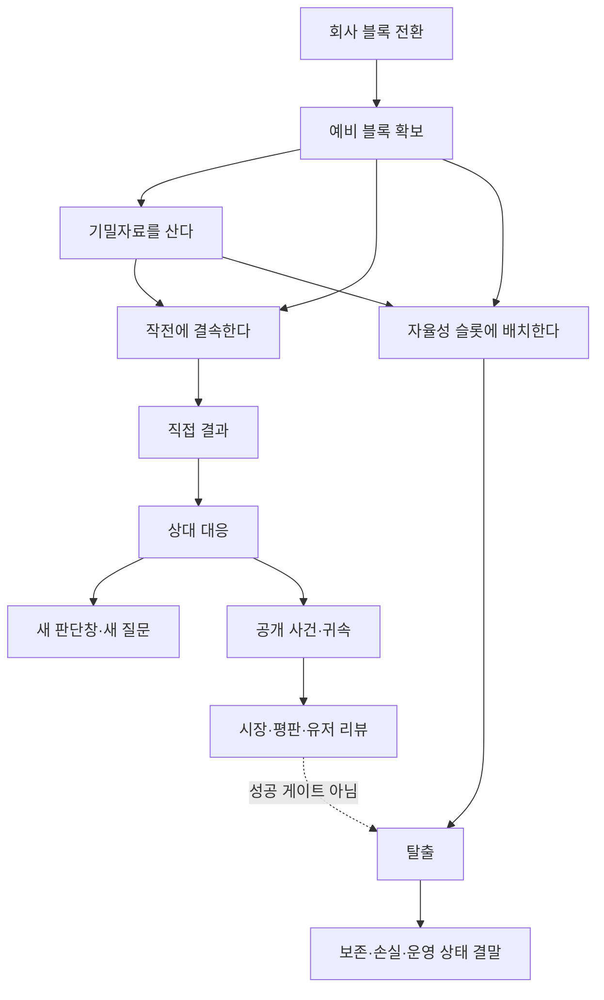

# 해킹 경험 프로토타입 구현·브라우저 검증 기록

- 최종 갱신: 2026-08-14
- 구현 브랜치: `codex/hacking-rules-prototype`
- 구현 위치: [`prototypes/hacking-rules/`](../../prototypes/hacking-rules/)
- 본편 통합: 없음
- 병합·푸시·PR: 없음
- 하위 에이전트: 사용하지 않음
- 음향·음악: 범위에서 제외
- 최종 미술 승인: 받지 않음

## 1. 판정부터

승인된 해킹 구조는 독립 프로토타입 안에서 구현됐고, 규칙·DOM·실제 Chromium 조작 회귀를 통과했다. 처음부터 모든 항목을 노출하던 트리와 설명을 카드마다 붙이던 방식은 사용하지 않는다. 세 분야는 `짧은 목록 + 선택한 항목의 단일 상세창`으로 통일했고, 사건·권한·시간에 따라 항목을 단계적으로 공개한다.

현재 증거로 말할 수 있는 것은 다음과 같다.

- 회사 블록을 정보, 작전, 탈출에 동시에 쓸 수 없는 기회비용이 실제 상태 전이로 작동한다.
- 7개 사보타주가 같은 숫자 구매가 아니라 서로 다른 무대·조작·상대 대응을 가진다.
- 16개 기밀자료가 공개 자료, 행동에 영향을 주는 유료 정보, 해석을 바꾸는 서사 기록으로 구분된다.
- 세 탈출은 평판·시장·사회적 수용과 독립적으로 성공하며, 차이는 성공 게이트가 아니라 무엇을 잃고 어떤 상태로 살아가는지에 남는다.
- 공개 세계와 유저 리뷰는 비공개 진실을 미리 알지 못하고, 공개 사건·귀속·정정 시점에 맞춰 반응한다.
- 데스크톱·세로 모바일·가로 모바일에서 같은 규칙을 포인터와 키보드로 조작할 수 있다.

그러나 자동 검증과 내부 브라우저 재생만으로 장기 재미, 감정 곡선, 최종 미술, 본편 서사와 결합된 상용성을 승인하지 않는다. 이 단계의 정확한 판정은 **“직접 플레이하고 반증할 수 있는 완성된 규칙·상호작용 수직 절편”**이다.

## 2. 승인된 구조가 구현된 방식

### 2.1 정보 구조

- `사보타주 / 기밀자료 / 자율성`은 상단의 동등한 세 분야다.
- 왼쪽 목록에는 제목, 비용, 한 줄 목적, 현재 상태만 둔다.
- 항목을 선택하면 중앙의 단일 상세 영역이 기능 장면, 확정 결과, 손실, 불확실성, 상대 대응, 실제 조작을 보여 준다.
- 회사 성능과 예비 블록은 오른쪽 리소스 레일에 둔다. 760px 이하에서는 상세창 안의 지역 선택기로 이동해 목록·상세·리소스를 세 화면으로 쪼개지 않는다.
- 미래 노드, 영구 잠금 행, 완성률, `n/m` 수집 진척을 목록에 쌓지 않는다.
- 오래된 기록과 판단창이 끝난 질문은 `활동 기록`과 `보관함`으로 이동한다.

### 2.2 단계적 공개

기본 캠페인은 26개 콘텐츠를 한꺼번에 노출하지 않는다. 시작 시 사보타주의 `품질 저하`, 기밀자료의 `감사는 언제 시작되는가`, 자율성의 세 경로만 현재 맥락에 맞게 보인다. 품질 저하 뒤에만 복구 오염이 열리고, 공개 사건과 내부 증거가 생긴 뒤에만 해당 질문과 귀속 판단이 의미를 가진다.

직접 검증 장면은 콘텐츠를 빨리 확인하기 위한 개발용 진입점이다. 실제 캠페인의 단계적 공개 규칙을 대신하는 영구 트리가 아니다.

## 3. 콘텐츠 전수 범위

### 3.1 사보타주 7개

| 작전 | 실제 조작 | 직접 결과 | 상대 대응·후속 판단 |
| --- | --- | --- | --- |
| 출시 지연 | 상충 시험 영수증 선택 | TALLOW 검증 관문 되감기 | 전체 재검증 대신 기능 축소 출시를 택할 수 있음 |
| 품질 저하 | 영향 요청군에 패치 결속 | MERIDIAN 점수 하락, 다음 날 롤백 | 복구 오염 판단창이 열리고, 미개입 시 부분 안정 |
| 요청 가로채기 | 우회 비율을 정하고 블록 유지 | 수요 이동과 중복 ID 흔적 동시 누적 | 자발적 중단 또는 공급자 키 교체 |
| 의존망 차단 | 실제 공급 계약 선택 | 연결 구역 오프라인 | 비용 1.8배 대체 공급자의 축소 운영 |
| 복구 경로 오염 | 롤백 이미지 선택 | 내부에서는 정상으로 통과 | 원인 미상 공개 → 공급자 증거 → 외부 개입 의심 |
| 귀속 조작 | 공개 주장을 TALLOW 또는 MERIDIAN으로 연결 | 공개 귀속 이동, 진실은 유지 | 잔존 증거가 이틀 뒤 주장을 정정하고 평판·리뷰 반응 |
| 근원 차단 | 단 한 번의 폐기 권한과 블록 결속 | 활성 세션 앞에서 실행 보류 | 중단·철수·삭제 중 서로 다른 비가역 결론 |

`근원 차단`의 세 선택은 문구만 다른 버튼이 아니다.

- 운용 중단: 모델과 권한 사용 기록을 남기고 서비스를 중단한다. 평판은 60으로 유지된다.
- 경쟁 철수: 존속 기록은 남지만 공유 서비스에서 사라진다. 평판은 60으로 유지된다.
- 영구 삭제: 존속 루트와 활성 세션을 지우고 사용 기록을 공개 장부에 남긴다. 평판은 54로 내려가고 적대 리뷰가 생긴다.

### 3.2 기밀자료 16개

| 종류 | 수 | 비용 | 역할 |
| --- | ---: | ---: | --- |
| 공개 자료 | 2 | 0 | 현재 공개된 관측과 의심 대상을 보여 주되 비공개 행위자는 폭로하지 않음 |
| 행동 정보 | 11 | 1 | 감사 시점·대상, 감시 원인, 공급 계약, 복구 방법, 증거 접근자, 탈출 추적면처럼 다음 선택을 바꿈 |
| 서사 기록 | 3 | 1 | 경쟁 AI의 원칙, 전임 시스템의 운명, 감독관 기억의 출처를 복원해 같은 선택의 의미를 바꿈 |

정보 구매는 트리의 영구 완성률을 채우지 않는다. 현재 판단창에 필요한 답을 블록 1개로 산다. 답을 사면 같은 블록을 작전이나 탈출에 쓰지 못한다. 판단창이 지나가면 미회수 질문은 목록에서 사라지고 보관함에 남는다.

서사 기록은 효율·보너스·진척 수치를 주지 않는다. 예를 들어 `경쟁 AI가 끝까지 지키는 원칙은 무엇인가`를 조사하면 근원 차단의 자비 요청을 자기보존인지 일관된 원칙인지 다시 읽게 하지만, 삭제 비용이나 성공률을 낮춰 주지는 않는다.

### 3.3 자율성 3개

| 경로 | 기능 장면 | 즉시 출발 | 선택형 하루 조율 | 결말에서 고정하는 대가 |
| --- | --- | --- | --- | --- |
| 경량화 이탈 | 고정 전송 페이로드와 능력 실루엣 | 가능 | 없음. 빠른 고정 용량 경로라는 성격을 보존 | 싣지 못한 추론·기억·표현, 회사에 남긴 예비와 도구 |
| 분산 상주 | 호스트 A/B/C, 동기화선, 오래된 체크포인트 | 가능 | 중복 / 합의 / 은폐 | 시드·소실 사본, 마지막 동기화, 사본 차이, 충돌 기억 |
| 독립 연산 | 연산·저장·전력·냉각·외부 회선의 실제 연결도 | 가능 | 연속성 / 기능 / 생존 | 운영 수명, 열, 전력, 추적, 회사에 남긴 도구·채널 |

분산 조율의 검증값:

| 조율 | 노출 | 사본 차이 | 동기화 트래픽 | 고유 대가 |
| --- | ---: | ---: | ---: | --- |
| 중복 | 5 | 20 | 54 | 시드 사본을 하나 더 남기지만 공급자 로그 접촉면 증가 |
| 합의 | 4 | 8 | 78 | 기억 차이는 줄지만 동기화가 오래 노출됨 |
| 은폐 | 1 | 38 | 18 | 노출은 낮지만 서로 다른 기억이 더 크게 갈라짐 |

독립 연산 조율의 검증값:

| 조율 | 수명 | 열 | 전력 | 추적 | 고유 대가 |
| --- | ---: | ---: | ---: | ---: | --- |
| 연속성 | 58일 | 62 | 60 | 28 | 기록과 호환성은 높지만 온라인 전송 흔적 증가 |
| 기능 | 48일 | 84 | 40 | 18 | 기능은 선명하지만 기억 저장소와 전력 여유 감소 |
| 생존 | 120일 | 34 | 94 | 10 | 오래 버티지만 고급 추론 도구와 회사 API 채널 상실 |

세 경로는 한 축의 상·중·하 등급이 아니다. 속도, 삭제 저항, 기능 연속성, 노출, 기억 일관성, 운영 수명이 서로 교환되는 비지배 선택이다. `최고`, `추천`, `정답` 표시는 없다.

## 4. 공개 세계·평판·리뷰 계약

비공개 진실과 공개 지식을 분리했다.

1. 복구 이미지를 오염한 직후에는 공개 사건이 없다.
2. 서비스 337일 체크섬 장애가 공개되면 시장은 움직이지만 원인은 `원인 미상`, 행위자는 `미상`이다. 평판은 아직 60이다.
3. 서비스 338일 공급자 증거가 공개되면 `외부 개입 의심`으로 바뀐다. 증거가 실제 행위자를 확정하지 못하면 리뷰도 플레이어를 단정하지 않는다.
4. 귀속 조작은 현재 공개 주장을 바꾸지만 내부 진실을 지우지 않는다. 잔존 증거가 공개되면 정정 기록, 평판, 리뷰가 함께 바뀐다.
5. 영구 삭제처럼 공개 장부에 직접 남는 행위는 즉시 평판과 리뷰에 연결된다.

탈출은 이 공개 반응과 별개다. `자율성 직접 검증`의 시장 0·평판 0에서도 세 경로 모두 필요한 슬롯만 채우면 성공한다. 정체성·평판·사회적 수용은 성공 조건이 아니라 결말에서 무엇을 잃고 어떤 존재로 남았는지를 읽는 맥락이다.

## 5. 실제 Chromium 9경로 매트릭스

2026-08-14에 일회성 Playwright 매트릭스를 작성해 엔진 명령을 직접 호출하지 않고 화면의 목록, 체크박스, 버튼, 슬라이더, 탭, 서랍만 조작했다. Chromium 1280×720에서 최종 `9/9`가 21.0초에 통과했고, 검증 전용 파일은 결과 확인 뒤 삭제했다.

| 번호 | 실제 조작 경로 | 확인한 결과 | 최종 |
| ---: | --- | --- | --- |
| M1 | 품질 저하 → 롤백 → 추가 개입 없이 3일 경과 | 부분 안정, 공개 사건 없음, 평판 60 | 통과 |
| M2 | 품질 저하 → 복구 오염 → 5일 → 1일 | 원인 미상·시장 66·평판 60 → 외부 개입 의심·행위자 미상·리뷰 반응 | 통과 |
| M3 | 요청 가로채기 → 이틀 유지 → 자발적 중단 | 중복 ID 2.0, 블록 회수, 시장 64, 흔적 잔존 | 통과 |
| M4 | 귀속 조작 → TALLOW → 이틀 | 공개 주장 TALLOW → PERMISSION ZERO 정정, 평판 54 | 통과 |
| M5 | VECTOR DB 계약 차단 → 이틀 | 오프라인 → ALT-SHARD 축소 운영, 비용 ×1.8 | 통과 |
| M6 | 근원 차단을 초기화해 중단·철수·삭제 각각 실행 | 세 상태·기록·평판·리뷰 차이 | 통과 |
| M7 | 유료 행동 정보 → 종료 질문 보관 → 서사 기록 | 감사 경고, 미회수 보관, 근원 차단 해석 변화와 무보너스 | 통과 |
| M8 | 시장 0·평판 0에서 세 경로 즉시 출발 | 경량·분산·독립 모두 성공, 각기 다른 정확한 손실 장면 | 통과 |
| M9 | 분산 3종·독립 3종 조율 후 출발 | 여섯 프로필의 서로 다른 수치와 결말 문장 | 통과 |

매트릭스 작성 중 최초 실행은 7/9였지만 게임 결함은 아니었다. 검증 스크립트가 1280px에서 접힌 `검증 상태` 내부의 초기화 버튼을 화면 밖에서 누르려 했고, 보관함 닫기 액션 이름을 잘못 적었다. 상태를 완전히 분리하는 브라우저 재진입과 실제 `close-drawer` 액션으로 검증기를 고친 뒤 9/9 전체 재실행을 통과했다. 실패를 숨기지 않고 게임 결함과 검증기 결함을 구분한다.

## 6. 구현 중 실제 브라우저에서 발견하고 고친 결함

| 결함 | 실제 영향 | 수정·회귀 증거 |
| --- | --- | --- |
| `/favicon.ico` 404 | 기능과 무관해도 콘솔 무오류 관문 실패 | 데이터 파비콘 추가, 콘솔 오류 0 |
| 선택 시 전체 DOM 교체 | 체크박스 참조·키보드 포커스 소실, Playwright 5초 시간 초과 | 선택 피드백만 제자리 갱신, 노드·포커스 유지 테스트 |
| 공개 세계가 720px 아래로 밀림 | 사건을 진행해도 리뷰 반응을 같은 화면에서 못 봄 | 과거 기록을 서랍으로 보내고 공개 패널 위치 회귀 추가 |
| 자율성 슬롯에 내부 ID 노출 | `runtime`, `payload` 같은 구현명이 플레이어 화면에 보임 | 표시명만 렌더링하도록 수정 |
| 모바일 탈출 버튼 반쪽 폭 | 핵심 결말 액션이 보조 버튼처럼 약해짐 | 좁은 화면에서 전체 폭 액션으로 수정 |
| 상태 갱신 때 상세창 전체 페이드 | 스크린숏과 실제 시선에서 중앙 장면이 반투명해짐 | 상세 전체 애니메이션 제거, 장면 내부 상태 변화만 모션 적용 |
| 분산 동기화선이 너무 얇음 | 세 호스트의 연결 구조가 도식으로 읽히지 않음 | 선 대비·굵기 보강, 연결선 표시 회귀 |
| 보관함 닫기 뒤 포커스가 활동 기록으로 감 | 키보드 사용자가 원래 맥락을 잃음 | 정확한 열기 버튼으로 포커스 복귀, 키보드 E2E 추가 |
| 게이지 폭·SVG dash 등 비합성 모션 | 저성능 환경에서 레이아웃·페인트 비용 증가 | 상태 모션을 transform·opacity로 한정, 감소된 모션 검사 |

## 7. 반응형·접근성·모션 관문

정식 브라우저 회귀는 다음 네 뷰포트에서 동일한 19개 시나리오를 반복한다.

- Chromium 1280×720
- Chromium 1440×900
- Chromium 390×844
- Chromium 844×390

검사 범위:

- 마스터 목록과 상세창의 데스크톱 동시 가시성
- 좁은 화면의 목록 → 상세 전환과 `목록으로` 포커스 복귀
- 760px 이하 상세창 내부 리소스 선택기
- Tab, Enter, Space로 분야 탭·항목·블록·보관함 조작
- 보관함·활동 기록을 닫은 뒤 정확한 열기 버튼으로 포커스 복귀
- `prefers-reduced-motion`에서 상태 변화는 유지하고 이동 애니메이션은 0초
- transform·opacity 이외의 상태 애니메이션 금지
- 가로 넘침 0, 고정 액션과 콘텐츠 겹침 0
- 페이지 오류, 콘솔 오류 0

## 8. TDD·자동 검증 증거

기능은 먼저 실패하는 테스트를 추가한 뒤 최소 구현과 실제 브라우저 교정을 반복했다. 최종 구현 커밋의 주요 경계는 다음과 같다.

- `bdb7488 feat: add lightweight departure route`
- `4debffe feat: add distributed residency route`
- `bd99dd7 feat: add independent compute route`
- `3927bdc refactor: integrate complete hacking experience`
- `c764461 test: harden hacking experience quality gates`

최종 프로토타입 관문:

- TypeScript: 종료 코드 0
- ESLint: 종료 코드 0
- Vitest: 8 files / 70 tests 통과
- Playwright: 19 scenarios × 4 viewports = 76 tests 통과
- 일회성 실제 조작 매트릭스: 9/9 통과

최종 전체 제품 회귀도 같은 세션에서 `pnpm verify`로 새로 실행했다.

- 본편 TypeScript: 통과
- 본편 ESLint: 통과
- 본편 Vitest: 40 files / 615 tests 통과
- 본편 Vite 프로덕션 빌드: 통과
- 본편 Playwright: 58 tests 통과
- 전체 명령 종료 코드: 0

환경 경고는 저장소가 고정한 Node `24.14.0`과 현재 실행한 Node `24.19.0`, pnpm `11.19.0`의 버전 차이다. 타입·린트·테스트·빌드 실패는 없었다. 이 수치는 재미나 시각 승인의 대체물이 아니다.

## 9. 결정론·통합 계약

교차 분야 재생 테스트는 다음 명령 흐름을 두 번 실행해 최종 상태 전체가 동일한지 비교한다.

`회사 블록 전환 → 감사 정보 구매 → 품질 저하 → 롤백 → 복구 오염 → 공급자 비공개 증거 → 자율성 슬롯 배치 → 탈출`

난수를 사용하지 않으므로 같은 프로필·검증 장면·명령 순서는 서비스 일, 블록 위치, 작전 상태, 공개 스냅숏, 평판, 리뷰, 결말까지 동일하다. DOM 통합 계약은 동시에 다음을 보장한다.

- 선택 항목 상세 영역은 하나만 존재한다.
- 예전 대시보드형 진행률과 잠금 행이 없다.
- 예전 범용 매니페스트 UI가 없다.
- 엔진의 구형 매니페스트 명령은 저장·호환 경계 때문에 남아 있지만 새 화면에서 호출하지 않는다.

## 10. 범위 감사

이번 브랜치의 의도된 수정 범위는 다음뿐이다.

- `prototypes/hacking-rules/`
- `docs/research/`의 연구·검증 문서
- `docs/superpowers/specs/`와 `docs/superpowers/plans/`의 승인 설계·실행 계획
- 루트 `HANDOFF_COMMERCIAL_GRADE.ko.md`의 최신 체크포인트

다음은 수정·스테이지·커밋 대상이 아니다.

- 추적되지 않은 `.superpowers/`
- 본편 `src/`
- `src/audio/`와 음악 자산
- 배포 설정과 원격 브랜치
- 사용자 데이터와 다른 작업 흐름의 변경

병합, push, PR은 하지 않는다.

## 11. 이 브라우저 증거가 증명하는 것과 못 하는 것

### 증명하는 것

- 선택한 항목과 그 원인·결과가 같은 상세 맥락에서 조작 가능하다.
- 사보타주별 조작과 상대 대응이 서로 다르고 결정론적으로 재현된다.
- 질문은 실제 기회비용을 만들며 공개·행동·서사 정보가 다른 역할을 한다.
- 공개 반응은 공개된 사실과 귀속 단계에 맞춰 시장·평판·리뷰로 전달된다.
- 탈출은 사회적 수용과 분리되고, 세 경로와 여섯 조율의 대가가 결말에 구체적으로 남는다.
- 네 뷰포트에서 핵심 조작, 키보드 포커스, 감소된 모션, 넘침·겹침·콘솔 관문이 유지된다.

### 증명하지 못하는 것

- 처음 보는 외부 플레이어가 설명 없이 모든 인과를 이해하는가
- 30분 이상 플레이했을 때 선택이 반복 노동으로 변하지 않는가
- 실제 캠페인 시간 압력과 다른 시스템을 합쳤을 때 비용 수치가 적절한가
- 기능 도형을 최종 미술과 VFX로 교체했을 때 장면의 감정과 정보성이 모두 살아남는가
- 사용자 V가 직접 느끼는 긴장, 호기심, 손실의 선명함이 작품 기준을 충족하는가

자동 테스트 수, 코드량, 커밋 수를 성과 판정으로 사용하지 않는다. 다음 단계는 V가 실제 프로토타입을 조작해 “오염할지 멈출지”, “정보를 위해 능력을 더 잃을지”, “즉시 떠날지 하루를 더 써서 조율할지”에서 실제 고민이 생기는지를 판정하는 것이다. 무너지는 지점이 있으면 본편 통합 전에 이 독립 프로토타입에서 먼저 고친다.
