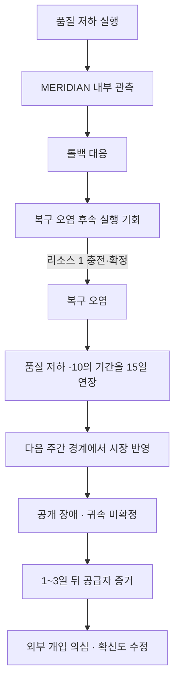

# PERMISSION ZERO — 해킹 통합 수정 2단계 B 설계

- 작성일: 2026-08-14
- 기준 구현: `origin/main` `5366cb496cee3eb3e6a11d791964900ef9e8d9f1`
- 기준 런타임: Node.js `24.14.0`
- 상태: **서면 검토 요청 · 엔진 미구현**
- 상위 판정: `docs/design/2026-08-14-hacking-integration-verdict.ko.md`
- 선행 계약: `docs/research/2026-08-14-hacking-integration-stage-1-contract.ko.md`

> **2026-08-16 상태 갱신:** 위 상태와 기준 커밋은 이 문서가 처음 작성된 시점의 기록이다. Stage 2B-1 공개 인과 기반은 이후 `main`에 반영됐고, Stage 2B-2/2B-3 작업 중간 상태는 로컬 체크포인트 `26a448c`에 보존돼 있다. 그러나 전체 Stage 2B와 최신 리소스·해킹 경제는 완료되지 않았다. 이 문서의 인과·저장·프로토콜 경계는 계속 유효하지만, 범용 리소스 비용·상한 18·미래 노드 공개에 기대는 부분은 [`2026-08-16-hacking-resource-uncertainty-contract.ko.md`](2026-08-16-hacking-resource-uncertainty-contract.ko.md)가 대체한다.

## 1. 결론

수정 2단계 B는 프로토타입을 병합하거나 곧바로 게임플레이를 늘리는 단계가 아니다. 다음 구현이 과거 저장·명령 재현·정보 경계를 깨지 않도록 **인과 결과 계약을 먼저 고정하는 단계**다.

채택안은 다음과 같다.

1. 첫 수직 사슬은 `품질 저하 → MERIDIAN 롤백 → 복구 오염 기회 → 원인 미상 공개 → 공급자 증거 → 외부 개입 의심`으로 제한한다.
2. MERIDIAN은 안정적 대응 성향 때문에 품질 저하를 관측하면 항상 롤백한다. 시드는 대응의 존재 여부가 아니라 롤백 속도, 증거 발견 시점·강도, 공개 시점을 바꾼다.
3. `복구 오염`은 신규 노드가 아니라 구매한 `sabotage.quality-degradation`의 결과로 열리는 후속 실행이다. 해금 비용은 없고 기존 규칙대로 실행 리소스 1을 충전한다.
4. 후속 실행의 충전은 기존 `hack-charge`를 재사용한다. 수정 2단계 B에서는 `BlockLocation`을 늘리지 않는다.
5. 새 인과 의미가 처음 활성화되는 구현은 저장 형식 v7, 명령 프로토콜 v3, 인과 규칙 v2를 함께 사용한다. v6나 프로토콜 v2의 의미를 제자리에서 바꾸지 않는다.
6. 기존 v1·v2·v3·v4·v5·v6 저장과 프로토콜 v1·v2 명령은 명시적인 프로토콜 구간을 통해 원래 의미로 재현한다.
7. 첫 사슬의 시장 효과는 별도 점유율 이전 수치를 만들지 않는다. 복구 오염은 품질 저하의 `-10`을 겹치지 않고 기존 `durationDays = 15`만 한 번 연장해, 기존 공개 성능과 기존 시장 공식에 반영되도록 한다.
8. `의존성 차단`은 신규 노드가 아니라 `sabotage.root-cutoff` 뒤에 열리는 후속 실행으로 확정한다. 다만 이번 첫 수직 사슬에는 구현하지 않는다.

이 문서가 승인되기 전에는 위 계약을 엔진 코드로 구현하지 않는다.

## 2. 이번 단계가 해결하는 문제

Stage 2A는 다음 기반을 이미 제공한다.

- 실제 행위자를 가진 비공개 사건
- 청중별 증거
- 증거를 요구하는 공개 귀속 수정
- 관찰자별 지식 투영
- 평판·시장 효과의 멱등 적용
- 결정론적 인과 ID
- 저장 형식 v6와 v1~v5 마이그레이션

그러나 현재 제품 경로에는 아직 다음이 없다.

- 사보타주 실행과 인과 사건의 연결
- 경쟁 AI가 관측한 정보에 근거해 고르는 대응
- 대응 결과로 열리는 후속 실행
- 증거 발견·공개 시점의 시드 변동성
- 사건 사이의 명시적인 부모 관계
- 공개 귀속의 확신도
- 기존 명령과 새 일일 처리 의미를 함께 보존하는 다중 프로토콜 경계

따라서 이번 단계의 성공 기준은 기능 수가 아니라 다음 문장이다.

> 같은 시드와 같은 명령 구간은 같은 대응·발견·공개를 만들고, 어떤 관찰자도 자신에게 도달하지 않은 증거나 실제 행위자를 사용하지 않으며, 과거 저장의 명령은 과거 규칙으로 그대로 재현된다.

## 3. 전수 확인 범위와 기준선

### 3.1 전체를 읽고 대조한 설계 문서

- `docs/design/2026-08-14-hacking-integration-verdict.ko.md`
- `docs/design/2026-08-14-rules-adjudication.ko.md`
- `docs/design/2026-08-14-review-schema-implementation.ko.md`
- `docs/design/2026-08-14-new-game-plus.ko.md`
- `PERMISSION_ZERO_STANDALONE_FINAL_SPEC.md`
- `docs/research/2026-08-14-hacking-integration-stage-1-contract.ko.md`
- `HANDOFF_COMMERCIAL_GRADE.ko.md`
- `docs/REPOSITORY_GUIDE.ko.md`
- `docs/spec-to-test-matrix.md`

### 3.2 전체를 읽고 대조한 제품 코드·테스트

- `src/game/model.ts`
- `src/game/rng.ts`, `src/game/rng.test.ts`
- `src/game/causality.ts`, `src/game/causality.test.ts`
- `src/game/hacking.ts`, `src/game/hacking.test.ts`, `src/game/sabotage.test.ts`
- `src/game/calendar.ts`, `src/game/reducer.ts`, `src/game/createCampaign.ts`
- `src/game/market.ts`, `src/game/market.test.ts`
- `src/game/reviews.ts`
- `src/game/persistence.ts`, `src/game/persistence.test.ts`
- `src/game/campaignStorage.ts`, `src/game/progressTransfer.ts`
- `src/game/replay.test.ts`

### 3.3 전체를 읽고 대조한 프로토타입 참조 원본

- `prototypes/hacking-rules/src/publicWorld.ts`
- `prototypes/hacking-rules/src/sabotage.ts`
- `prototypes/hacking-rules/src/scenario.ts`

### 3.4 깨끗한 기준선 검증

별도 작업 트리에서 공식 Node.js 24.14.0 Windows x64 배포본의 SHA-256을 공식 `SHASUMS256.txt`와 대조한 뒤 고정 잠금 파일로 설치했다. 기준 커밋에서 다음이 모두 통과했다.

- TypeScript: 통과
- ESLint: 통과
- Vitest: 41개 파일, 650개 테스트 통과
- Vite: 73개 모듈 빌드 통과
- Playwright: 58개 시나리오 통과

따라서 이 문서가 기록한 차이는 기준선 실패를 해석한 것이 아니라 실제 코드 계약을 대조한 결과다.

## 4. 문서 주장과 현재 코드 사이의 수정 사항

### 4.1 현재 저장 형식은 v5가 아니라 v6다

상위 판정 문서 4.3절은 작성 당시 저장 형식을 v5로 기록하고 인과층과 `BlockLocation` 확장이 v6를 요구한다고 판단했다. Stage 2A 이후 현재 코드는 이미 다음 상태다.

- `SAVE_FORMAT_VERSION = 6`
- v1~v5를 v6 런타임 상태로 이관
- `CausalState`를 v6의 필수 정확 스키마로 검증
- v6 진행 내보내기 `PZ6:` 및 `.pz6`

따라서 다음 변경은 v6를 다시 정의하는 것이 아니라 v7이어야 한다.

### 4.2 `BlockLocation` 확장은 첫 후속 실행에 필요하지 않다

상위 판정 문서는 프로토타입의 작전 투자분을 근거로 새 블록 위치가 최소 하나 필요하다고 보았다. 그러나 본편에는 이미 다음 원자적 흐름이 있다.

```text
reserve
  → CHARGE_SABOTAGE
  → hack-charge(nodeId)
  → 확정 실행
  → consumed(sabotage)
```

`복구 오염`은 새 노드가 아니라 품질 저하의 후속 실행이므로 같은 `nodeId`의 기존 충전을 그대로 쓸 수 있다. 기회가 열렸다는 이유만으로 블록을 자동 이동하지 않고, 플레이어가 충전한 뒤 실행을 확정할 때만 소모한다.

새 위치는 다음 조건이 실제로 생길 때만 다시 검토한다.

- 한 노드에 여러 투자 블록을 동시에 장기간 보관해야 함
- 여러 후속 기회를 동시에 충전 상태로 구분해야 함
- 블록을 노드가 아니라 별도 경로 슬롯에 귀속해야 함

첫 수직 사슬에는 어느 조건도 없다. 불필요한 위치 추가와 마이그레이션 표면을 만들지 않는다.

### 4.3 현재 공개 지식 투영은 사건 존재를 너무 넓게 보여 준다

현재 `projectCausalKnowledge`는 증거 접근 여부와 무관하게 모든 사건의 날짜·종류·대상을 모든 관찰자에게 반환한다. 실제 행위자는 숨지만, 사건 자체를 관찰하지 못한 경쟁 AI와 대중도 사건 껍데기를 안다.

이는 “경쟁 AI도 실제로 관찰하거나 전달받은 정보만 사용한다”는 채택 규칙에 충분하지 않다. 인과 규칙 v2에서는 사건 투영도 증거 접근 경계 안으로 넣는다.

### 4.4 현재 시장 직접 이전은 지속 원인으로 쓸 수 없다

`applyCausalEffect`의 `market-transfer`는 호출 시점의 점유율을 정확히 옮기고 총합 100을 지킨다. 그러나 이후 주간·월간 시장 갱신은 성능·평판·가용성으로 점유율을 다시 계산한다. 따라서 직접 이전을 장기 인과 결과처럼 사용하면 다음 갱신에 의미가 사라질 수 있다.

첫 사슬은 새 점유율 이전 수치를 만들지 않는다. 현재 MERIDIAN의 품질 저하 점수는 일일 회복값이 아니라 `intrinsicServiceScore - 활성 품질 페널티 10`으로 다시 계산되므로, 단순히 회복만 막는 설계는 실제 효과가 없다. 복구 오염은 정확한 부모 품질 저하 기록의 종료일을 기존 `durationDays = 15`만큼 한 번 연장하고, 기존 주간 시장 공식이 더 오래 유지된 공개 성능을 반영하게 한다.

### 4.5 현재 단일 명령 접두사로는 v1→v2→v3을 보존할 수 없다

현재 `CommandProtocolMetadata`는 `version`과 `legacyCommandCount`만 가진다. 이는 “v1 접두사 뒤 v2” 한 경계는 표현하지만, 이미 v1→v2 기록을 가진 캠페인이 v3로 계속될 때 세 구간을 표현하지 못한다.

또한 `ADVANCE_DAY`에 새 인과 처리를 넣고 과거 v2 명령까지 v3로 재생하면 과거 날짜에 새 대응 사슬이 소급 생성된다. 따라서 v3는 명시적인 프로토콜 타임라인이 필요하다.

## 5. 접근법 비교

| 접근 | 내용 | 장점 | 실패 지점 | 판단 |
|---|---|---|---|---|
| A. 프로토타입 상태 기계 이식 | `OperationRun`, 공개 스냅샷, 작전별 투자 상태를 본편에 옮김 | 눈에 보이는 사슬을 빠르게 복제 | 중복 캠페인 상태, 고정 날짜, 하드코딩 경쟁자, 기각된 경제가 함께 유입 | 기각 |
| B. v6·프로토콜 v2 제자리 확장 | 현재 배열과 스트림에 결과만 덧붙이고 저장 번호를 유지 | 변경 파일이 적음 | 과거 `ADVANCE_DAY` 의미 변경, v6 정확 스키마 변조, v1→v2→v3 구간 상실 | 기각 |
| C. 버전 경계를 둔 첫 수직 사슬 | 저장 v7·프로토콜 v3·인과 규칙 v2로 한 사슬만 완성하고 기존 구간을 보존 | 재현성·저장·정보 경계를 함께 지킴 | 마이그레이션과 검증 범위가 큼 | **채택** |

C안은 넓은 기능 이식이 아니라 가장 작은 완결 사슬을 먼저 증명한다. 이 사슬이 통과해야 다른 사보타주, 점진 공개, 리뷰 반응을 같은 계약 위에 추가한다.

## 6. 고정 제약

- 12개 해킹 노드 ID를 바꾸지 않는다.
- 노드 비용 `3~18`, 전체 104, 확보 상한 18, 전용 의심 `+2.4`를 바꾸지 않는다.
- 압축 표현 `+5%`를 유지한다.
- `prototypes/hacking-rules/`를 삭제하거나 제품 경로로 병합하지 않는다.
- `hiddenEvidence`를 즉시 제거하지 않는다. 기존 감사·결말 계약이 소비하므로 구조화된 인과 증거와 병행한다.
- 첫 사슬에서 신규 경쟁자, 신규 통화, 신규 노드, 신규 차단 팝업을 만들지 않는다.
- 실제 행위자와 관찰 가능한 증거를 같은 객체로 노출하지 않는다.
- 공개 귀속은 반드시 해당 발행자가 접근 가능한 증거 ID를 하나 이상 인용한다.
- 기존 v1~v6 저장을 추측으로 보정하지 않는다. 알 수 없는 값은 “이전 저장에서 기록 없음”으로 보존한다.
- 기존 사보타주 하루 1건 해결 제한과 다음 날 실행 규칙을 유지한다.
- 리뷰 문장과 UI 점진 공개는 이 수직 사슬의 상태 계약이 통과한 뒤 별도 단계에서 연결한다.

## 7. 버전 계약

### 7.1 세 버전 축

| 축 | 현재 | 첫 새 인과 사슬 | 의미 |
|---|---:|---:|---|
| 저장 컨테이너 | 6 | 7 | 직렬화 스키마와 마이그레이션 |
| 명령 프로토콜 | 2 | 3 | 같은 명령이 만드는 상태 전이 의미 |
| 인과 규칙 | 1 | 2 | 사건 관계, 투영, 결과 슬롯 의미 |

세 번호를 하나로 취급하지 않는다. 다만 첫 활성화는 한 커밋 경계에서 함께 이뤄져야 중간 상태를 저장하지 않는다.

### 7.2 명령 프로토콜 타임라인

v7 런타임 상태와 저장 봉투는 다음 의미의 메타데이터를 사용한다.

```ts
type CommandProtocolVersion = 1 | 2 | 3

interface CommandProtocolSegment {
  version: CommandProtocolVersion
  startsAtSequence: number
}

interface CommandProtocolMetadata {
  segments: CommandProtocolSegment[]
}
```

예시:

```text
신규 v3 캠페인
  [{ version: 3, startsAtSequence: 1 }]

명령 240개가 있는 네이티브 v2 저장을 이관
  [{ version: 2, startsAtSequence: 1 },
   { version: 3, startsAtSequence: 241 }]

v1 명령 31개 뒤 v2 명령 19개가 있는 저장을 이관
  [{ version: 1, startsAtSequence: 1 },
   { version: 2, startsAtSequence: 32 },
   { version: 3, startsAtSequence: 51 }]
```

검증 규칙:

1. 첫 구간은 명령 1에서 시작한다.
2. 버전은 오름차순이며 같은 버전이 반복되지 않는다.
3. 시작 시퀀스는 엄격히 증가한다.
4. 마지막 구간만 아직 명령이 없는 `commandCount + 1`에서 시작할 수 있다.
5. 마지막 구간 버전이 현재 활성 버전이다. v7 네이티브 상태의 마지막 구간은 반드시 v3다.
6. 명령 N은 N 이하에서 가장 늦게 시작한 구간의 규칙으로 검증·실행한다.
7. 재현은 기본 `createCampaign`의 현재 버전을 무조건 쓰지 않는다. 첫 구간 버전에 맞는 호환 기준 상태를 만들고, 이후 각 구간 진입 직전에 순수한 버전 활성화 변환을 한 번 적용한다.
8. 마지막 v3 구간이 비어 있어도 재현 종료 전에 v3 활성화 변환을 적용해 이관 체크포인트와 일치시킨다.

현재 `CampaignState.saveVersion`과 `legacyCommandCount`는 런타임의 `commandProtocol` 타임라인으로 대체한다. 직렬화된 v7에서는 저장 봉투의 `commandProtocol`이 단일 정본이고 체크포인트에는 중복 저장하지 않는다. 디코더가 검증한 값을 런타임 `CampaignState`에 주입한다. 같은 사실을 두 위치에 저장해 모순 가능성을 만들지 않는다.

#### 7.2.1 독립 리플레이 부트스트랩 정본

명령 프로토콜 타임라인은 명령 의미만 소유한다. 빈 v1과 빈 v2가 모두 `3@1`로 이관되므로 시작 사건과 과거 리뷰 이관 범위는 다음 독립 메타데이터가 소유한다.

```ts
type ReplayOpeningVersion = 1 | 2

interface ReplayBootstrapMetadata {
  openingVersion: ReplayOpeningVersion
  legacyReviewPrefixCount: number
}
```

네이티브 값은 `{ openingVersion: 2, legacyReviewPrefixCount: 0 }`이다. 직렬화된 v7 portable save와 v7 local manifest는 `commandProtocol`의 형제로 `replayBootstrap`을 정확히 한 번 저장하고, 둘 다 체크포인트에서는 제외한다. v7 체크포인트 해시는 고정 키 순서 `{ commandProtocol, replayBootstrap, state: checkpoint }`를 사용한다. 명령 지문과 인과 RNG namespace에는 이 표시 출처를 넣지 않는다.

v1~v6은 각 원본 exact schema와 기존 무결성 조리법을 먼저 통과한 뒤에만 메타데이터를 합성한다. v1은 동결된 v1 시작 사건과 전체 이관 리뷰 feed, v2~v4는 검증된 v1 lineage 또는 동결 시작 사건과 전체 이관 feed, v5/v6은 두 동결 seq-0 사건 중 정확히 하나와 선두의 연속 `legacy-save` 리뷰 수를 사용한다. native snapshot 뒤의 `legacy-save`는 표현 불가능하므로 거부한다. v7은 저장값을 필수 exact 입력으로 검증하며 추론하거나 기본값을 넣지 않는다.

리플레이 API는 `commandProtocol`과 `replayBootstrap`을 한 필수 객체로 받는다. 시작 사건은 선택된 동결 사건과 정확히 일치해야 하고, 인덱스 `[0, legacyReviewPrefixCount)`만 정확한 `legacy-save` snapshot으로 정규화한다. 이 정규화는 활성 명령 프로토콜과 무관하게 승인된 각 명령 뒤 다시 적용되며 native suffix는 바꾸지 않는다. v1 구간이 있는 타임라인은 opening version 1을 요구하지만, 빈 v1 lineage 때문에 역은 요구하지 않는다.

### 7.3 v1~v6 → v7 마이그레이션

1. 기존 형식별 검증기는 원래 스키마 그대로 입력을 먼저 검증한다.
2. 저장된 명령·사건·ID·작성자 문장 스냅샷은 바꾸지 않는다.
3. 기존 `legacyCommandCount`와 전체 명령 수로 명령을 하나 이상 소유한 v1·v2 구간만 정확히 복원한다. 빈 과거 구간은 만들지 않는다.
4. 마지막에 비어 있는 v3 구간을 `commandCount + 1`에서 연다.
5. v1~v5의 빈 인과 상태는 규칙 v2의 빈 상태가 된다.
6. v6 인과 기록은 ID·시퀀스·증거·귀속·효과를 그대로 유지한다.
7. v6 사건에는 종류에 따라 `legacy.sabotage`, `legacy.competitor-response`, `legacy.service-disruption` 행동 ID와 `parentIncidentId: null`을 붙인다.
8. v6 공개 귀속에는 `confidence: unavailable-legacy`를 붙인다. 근거 없이 확신도를 발명하지 않는다.
9. 디코더 결과의 `envelope.version`은 입력 원본 버전을 계속 보고하고, 다시 저장할 때만 v7로 쓴다.

진행 이전 경계:

- 새 내보내기 접두사: `PZ7:`
- 새 파일 확장자: `.pz7`
- 가져오기는 `PZ2:`~`PZ6:`과 v1~v6 파일을 계속 허용한다.
- 브라우저 `SAVE_STORAGE_KEY`와 `permission-zero-local-v3` 저장 레이아웃 이름은 바꾸지 않는다. 둘은 게임 저장 형식 번호가 아니라 기존 저장 위치·원자적 로컬 레이아웃 계약이다.

## 8. 인과 규칙 v2 데이터 계약

### 8.1 사건 관계

`CausalIncident`에 다음을 추가한다.

```ts
interface CausalIncident {
  // 기존 필드 유지
  parentIncidentId: string | null
  actionId: CausalActionId
}
```

첫 수직 사슬에서 쓰는 안정 ID:

```text
sabotage.quality-degradation
response.meridian.rollback.fast
response.meridian.rollback.standard
response.meridian.rollback.forensic
follow-up.recovery-contamination
```

마이그레이션 전용 ID:

```text
legacy.sabotage
legacy.competitor-response
legacy.service-disruption
```

관계 검증:

- 루트 사건만 `parentIncidentId: null`을 허용한다.
- 부모 ID는 이미 존재하는 더 낮은 사건 시퀀스를 가리켜야 한다.
- 자기 참조, 미래 참조, 순환은 거부한다.
- 행동 ID와 사건 종류의 허용 조합을 정확 목록으로 검증한다.
- 같은 부모에 같은 단일 실행 후속 행동을 두 번 기록하지 않는다.
- `response.meridian.rollback.fast|standard|forensic`는 하나의 의미 계열이다. 한 품질 저하 부모 아래에는 이 계열 자식이 최대 하나만 존재하며, 선택된 동일 관계의 정확 ID 재시도만 기존 멱등 no-op이다. mutation과 저장 검증이 같은 규칙을 적용한다.
- `legacy.*` 행동은 마이그레이션 전용 루트 예외로 `parentIncidentId: null`을 허용한다. 네이티브 규칙 v2 변이 API는 이를 새로 만들 수 없다.

`actionId`와 `parentIncidentId`는 실제 인과 진실이며 일반 지식 투영에 자동 포함하지 않는다.

첫 사슬의 사건 종류 조합은 다음과 같다.

| `actionId` | `kind` | 대상 |
|---|---|---|
| `sabotage.quality-degradation` | `sabotage` | `meridian` |
| `response.meridian.rollback.*` | `competitor-response` | `meridian` |
| `follow-up.recovery-contamination` | `service-disruption` | `meridian` |

### 8.2 공개 귀속 확신도

`PublicAttributionRevision`에 다음을 추가한다.

```ts
type AttributionConfidence =
  | 'unavailable-legacy'
  | 'unconfirmed'
  | 'plausible'
  | 'credible'
```

- `unavailable-legacy`: v6 기록 이관에만 사용
- `unconfirmed`: 공개 현상은 있으나 행위자 근거가 없음
- `plausible`: 시간·경로 상관관계는 있으나 행위자 특정 증거가 부족함
- `credible`: 서명된 경로 기록처럼 독립 확인 가능한 강한 증거가 있음

확신도는 임의 수치가 아니라 인용 증거 종류에서 결정한다. 시드는 어떤 증거가 살아남는지를 정할 수 있지만, 같은 증거가 서로 다른 확신도를 내게 하지는 않는다.

### 8.3 관찰자 지식 투영

인과 규칙 v2의 `projectCausalKnowledge`는 다음을 지킨다.

1. 관찰자가 접근 가능한 증거가 있거나 공개 귀속 수정이 있는 사건만 투영한다.
2. 증거 없는 비공개 사건의 존재·날짜·종류·대상은 다른 관찰자에게 보이지 않는다.
3. `privateTruth`, `actionId`, `parentIncidentId`, 증거 청중 목록은 투영하지 않는다.
4. 공개 귀속 수정은 누구나 볼 수 있지만, 비공개 증거 본문은 공개 수정에 인용됐다는 이유만으로 노출하지 않는다.
5. 경쟁 AI의 정책 함수는 `CampaignState` 전체가 아니라 자신의 `CausalKnowledgeProjection`과 공개 경쟁 상태만 입력으로 받는다.
6. 플레이어의 후속 실행 선택기도 회사 관찰자 투영에 롤백 관측이 있을 때만 기회를 연다.

### 8.4 첫 사슬의 증거 종류

| 증거 `kind` | 연결 사건 | 청중 | 논리적 용도 |
|---|---|---|---|
| `meridian-quality-regression` | 품질 저하 | 경쟁자 `meridian` | MERIDIAN 대응 근거 |
| `company-observed-meridian-rollback` | 롤백 대응 | 회사, 경쟁자 `meridian` | 후속 실행 기회 공개 |
| `public-recovery-checksum-anomaly` | 복구 오염 | 대중 | 최초 원인 미상 공시 |
| `provider-timing-correlation` | 복구 오염 | 공급자 `provider.meridian-recovery` | `plausible` 귀속 근거 |
| `provider-signed-route-record` | 복구 오염 | 공급자 `provider.meridian-recovery` | `credible` 귀속 근거 |

증거 `kind`는 규칙 판정에 쓰는 안정 ID다. 규칙 v2 네이티브 생성 API는 작가 문장을 받거나 저장하지 않고 `legacySummary: null`과 위 안정 ID만 기록한다. v6의 정확한 원본 `summary` 문장은 원본 스키마 검증 뒤 `legacySummary`로 손실 없이 이관하고, 기존 임의 `kind`와 함께 보존하되 새 규칙 판정의 입력으로 사용하지 않는다. 엔진은 어느 prose 필드도 파싱하거나 문구 일치로 분기하지 않는다.

## 9. 결정론적 결과 스트림

### 9.1 ID 스트림과 결과 스트림을 분리한다

기존 스트림은 ID 생성 전용으로 유지한다.

```text
causal-incident
causal-evidence
causal-revision
causal-effect
```

다음 결과 스트림을 새로 고정한다.

```text
causal-response-outcome
causal-evidence-discovery
causal-attribution-publication
```

ID 스트림을 결과 판정에 재사용하지 않는다. 새 ID 하나가 추가됐다는 이유로 대응 확률이 바뀌어서는 안 된다.

### 9.2 롤 키

각 롤은 다음 값으로만 결정한다.

```text
campaignSeed
causal rules version
canonical command-protocol segment starts
source incident ID
source incident occurredOnServiceDay
named outcome stream
frozen slot number
```

개념식:

```ts
random01(
  `${campaignSeed}|causal-rules-2|${protocolFingerprint}|${incident.id}`,
  incident.occurredOnServiceDay,
  stream,
  slot,
)
```

슬롯은 스트림별 등록표에 고정한다. 기존 슬롯의 의미를 바꾸거나 중간에 끼워 넣지 않는다. 의미 변경이 필요하면 인과 규칙 버전을 올린다.

### 9.3 첫 사슬의 슬롯과 결과

| 스트림 | 슬롯 | 입력 사건 | 결과 |
|---|---:|---|---|
| `causal-response-outcome` | 0 | 품질 저하 사건 | 롤백 속도와 후속 실행 마감 |
| `causal-evidence-discovery` | 0 | 복구 오염 사건 | 공급자 증거 발견 지연 1~3일 |
| `causal-evidence-discovery` | 1 | 복구 오염 사건 | 시간 상관관계 / 서명 경로 기록 |
| `causal-attribution-publication` | 0 | 복구 오염 사건 | 발견 당일 / 다음 날 공개 |

MERIDIAN 롤백 속도는 같은 폭의 세 구간을 사용한다.

| 롤 | 대응 ID | 후속 실행 가능 마지막 날 |
|---:|---|---:|
| `[0, 1/3)` | `response.meridian.rollback.fast` | 대응일 +2 |
| `[1/3, 2/3)` | `response.meridian.rollback.standard` | 대응일 +3 |
| `[2/3, 1)` | `response.meridian.rollback.forensic` | 대응일 +4 |

공급자 증거 발견일:

```text
공개 장애일 + 1 + floor(discoveryRoll * 3)
```

증거 강도:

| 롤 | 증거 종류 | 공개 귀속 | 확신도 |
|---:|---|---|---|
| `[0, 0.5)` | `provider-timing-correlation` | `external-operator` | `plausible` |
| `[0.5, 1)` | `provider-signed-route-record` | `external-operator` | `credible` |

발행 시점:

| 롤 | 공개일 |
|---:|---|
| `[0, 0.5)` | 증거 발견 당일 |
| `[0.5, 1)` | 증거 발견 다음 날 |

확신도는 발행 롤이 아니라 증거 종류에서 나온다.

## 10. 첫 수직 인과 사슬



### 10.1 D일 — 품질 저하 해결

기존 규칙을 유지한다.

- 충전된 리소스는 대상 확정 때 이미 `consumed(sabotage)`가 됨
- 예약은 다음 서비스 일에 실행
- 한 서비스 일에 사보타주 최대 1건 해결
- MERIDIAN 성능에 기존 `-10`, 기존 15일 비중첩 기록
- 기존 `hiddenEvidence +2`

추가되는 원자적 기록:

1. `kind: sabotage`
2. `actionId: sabotage.quality-degradation`
3. `parentIncidentId: null`
4. 실제 행위자 `player`
5. 대상 `meridian`
6. MERIDIAN 전용 내부 성능 회귀 증거

사보타주 효과 적용과 인과 사건 기록 중 하나만 성공한 중간 상태를 반환하지 않는다. 내부 전이 전체가 성공하거나 원래 상태를 반환한다.

### 10.2 D일 — MERIDIAN 롤백

달력은 기존 경쟁자 일일 갱신 뒤, 주간 시장·리뷰 갱신 전에 인과 대응을 처리한다.

MERIDIAN 정책 입력:

- MERIDIAN 관찰자 지식 투영
- 자신의 공개 상태·가용성·성능
- 실제 행위자, 회사 전용 증거, 다른 경쟁자의 비공개 증거는 제외

MERIDIAN은 품질 회귀를 직접 관측했으므로 반드시 롤백한다. 결과 스트림은 롤백의 속도와 플레이어가 개입할 수 있는 2·3·4일 창을 정한다.

추가 기록:

- `kind: competitor-response`
- `actionId: response.meridian.rollback.*`
- `parentIncidentId`: 품질 저하 사건
- 실제 행위자 `meridian`
- 대상 `meridian`
- 회사와 MERIDIAN이 접근 가능한 롤백 관측 증거

이 증거가 생긴 뒤에만 회사 관찰자용 `recovery-contamination` 기회 선택기가 열림을 반환한다.

### 10.3 D일~D+2·3·4 — 복구 오염 후속 실행

기회 ID는 부모 롤백 사건과 후속 행동 ID에서 결정론적으로 파생한다. 별도 `opportunities` 배열을 저장하지 않는다.

```text
follow-up:<rollbackIncidentId>:recovery-contamination
```

실행 흐름:

1. 플레이어가 기존 `CHARGE_SABOTAGE`로 `sabotage.quality-degradation`에 리소스 1을 충전한다.
2. 새 프로토콜 v3 명령 `EXECUTE_SABOTAGE_FOLLOW_UP`은 `opportunityId`만 받는다.
3. 명령은 기회가 열려 있고 미사용이며 마감일 이내인지 확인한다.
4. 해당 노드의 정확한 `hack-charge` 하나를 소모한다.
5. 품질 저하 노드의 기존 `evidenceDelta +2`를 `hiddenEvidence`에 한 번 적용한다.
6. 복구 오염 사건을 즉시 기록한다.

복구 오염 사건:

- `kind: service-disruption`
- `actionId: follow-up.recovery-contamination`
- `parentIncidentId`: 롤백 사건
- 실제 행위자 `player`
- 대상 `meridian`

실행을 취소하거나 기회가 만료되기 전에 충전을 취소하면 기존 규칙대로 블록을 예비 영역에 돌려놓는다. 기회 만료만으로 충전 블록을 자동 소모하지 않는다.

### 10.4 복구 오염의 실제 효과

복구 오염은 부모 품질 저하에 대응하는 정확한 `SabotageRecord`의 `effectEndsOnServiceDay`에 그 노드의 기존 `durationDays = 15`를 한 번 더한다.

- 품질 페널티 `-10`을 두 겹으로 적용하지 않는다.
- 새 점수나 새 기간 수치를 만들지 않는다.
- `intrinsicServiceScore`, 평판, 연구 진척, 가용성을 직접 바꾸지 않는다.
- 다른 경쟁자의 일일 갱신을 바꾸지 않는다.
- 같은 부모 롤백 사건에서는 한 번만 연장할 수 있다.

정확한 부모 기록은 부모 품질 저하 사건의 대상, `actionId`, 발생일과 기존 사보타주 기록의 대상, `nodeId`, `resolvedOnServiceDay`를 대조해 찾는다. 현재 전역 하루 1건 해결 제한 때문에 이 조합은 하나여야 하며, 없거나 둘 이상이면 실행을 거부한다.

이 방식은 프로토타입의 하드코딩 점수 `58`, 점유율 `34`, 플레이어 `+4`를 가져오지 않는다. 기존 본편의 품질 페널티와 시장 경제가 결과를 계산한다.

### 10.5 W일 — 원인 미상 공개

W는 복구 오염 실행 다음 날 이후 처음 도달하는 기존 주간 시장 경계다. 이미 그날의 주간 갱신을 지난 뒤 실행한 명령이 같은 날짜의 시장을 소급 변경하지 않는다.

주간 시장 계산 전에 다음을 원자적으로 기록한다.

- 공개 체크섬·응답 불일치 증거
- 발행자 `public`
- 귀속 `unresolved`
- 확신도 `unconfirmed`

공개 투영은 현상과 대상은 보여 주되 실제 행위자, 품질 저하, 롤백 부모 관계, 복구 오염 행동 ID를 보여 주지 않는다.

그 뒤 기존 시장 계산은 현재 MERIDIAN 성능을 사용한다. 별도 `market-transfer`를 적용하지 않는다.

### 10.6 P일 — 공급자 증거와 귀속 수정

P는 W에서 1~3일 뒤의 발견일과, 발견 당일 또는 다음 날의 발행 지연을 합친 날이다.

발견 시:

- 증거는 복구 오염 사건에 연결한다.
- 청중은 해당 복구 공급자다.
- 증거 종류는 결과 슬롯 1이 고른다.

발행 시:

- 발행자는 그 공급자다.
- 귀속은 `external-operator`다.
- 확신도는 증거 종류에 따라 `plausible` 또는 `credible`이다.
- 이전 `unresolved` 수정은 지우지 않고 새 수정 행을 덧붙인다.

첫 수직 사슬은 여기서 끝난다. 플레이어 특정, 허위 귀속 조작, 역추적 반전, 직접 평판 효과는 후속 사슬에서 다룬다.

## 11. 달력 처리 순서

프로토콜 v3의 `ADVANCE_DAY`는 다음 순서를 고정한다.

1. 서비스 일 증가
2. 기존 월초 처리
3. 기존 예약 사보타주 최대 1건 해결과 해당 루트 인과 사건 기록
4. 기존 의심 감소와 위장 복구
5. 기존 경쟁자 일일 갱신
6. 새 인과 대응·증거 발견·귀속 발행 처리
7. 기존 자비 요청 검사
8. 기존 주간 시장 스냅샷
9. 기존 리뷰 생성
10. 기존 월간 평가·감사
11. 기존 이야기 예약과 기억 누출

같은 날 공개된 증거는 그날 이후의 시장·리뷰 후보가 볼 수 있다. 같은 날 뒤늦게 처리돼 이미 만든 리뷰를 소급 수정하지 않는다.

프로토콜 v1·v2의 `ADVANCE_DAY` 순서는 현재 구현 그대로 유지한다.

## 12. 파생 상태와 저장 상태의 경계

저장하는 것:

- 프로토콜 타임라인
- 인과 규칙 버전
- 사건의 부모 관계와 행동 ID
- 청중별 증거
- 공개 귀속 수정과 확신도
- 적용된 인과 효과
- 연장된 기존 `SabotageRecord.effectEndsOnServiceDay`

파생하는 것:

- 후속 실행 기회 ID
- 후속 실행 열림·만료·사용 여부
- 응답·발견·발행 예정일
- 관찰자별 가시 사건 목록

예정일을 파생할 수 있는 이유는 규칙 v2, 사건 ID, 발생일, 스트림, 슬롯이 모두 저장되어 있기 때문이다. 실제로 사건이나 증거가 생겼는지는 append-only 배열이 멱등 완료 표식이 된다.

같은 파생 결과를 여러 UI와 엔진이 따로 계산하지 않는다. 순수 선택기 하나를 공유한다.

## 13. 실패 처리

새 전이는 기존 변이 함수처럼 입력 상태를 직접 수정하지 않고 성공·실패 합성곱을 반환한다.

필수 실패 사유:

```text
INCIDENT_NOT_FOUND
INVALID_PARENT_INCIDENT
INVALID_ACTION
CAUSAL_CYCLE
OPPORTUNITY_NOT_FOUND
OPPORTUNITY_NOT_VISIBLE
OPPORTUNITY_EXPIRED
OPPORTUNITY_ALREADY_USED
NODE_NOT_CHARGED
CHARGED_RESOURCE_MISSING
SABOTAGE_RECORD_NOT_FOUND
PROTOCOL_MISMATCH
```

원자성 규칙:

- 사보타주 효과만 적용되고 인과 기록이 빠진 상태를 반환하지 않는다.
- 충전 블록만 소모되고 후속 사건이 빠진 상태를 반환하지 않는다.
- 같은 날 하나의 원자적 공개 묶음으로 예정된 증거만 생기고 그 공개 수정이 실패한 상태를 반환하지 않는다. 발견과 발행이 다른 날로 예정된 공급자 증거는 예외가 아니라 의도한 중간 상태다.
- 같은 일일 처리나 명령을 재시도하면 동일 ID의 정확한 기록은 무동작 성공, 다른 내용 충돌은 실패다.
- 손상된 부모 관계나 알 수 없는 행동 ID를 저장 로드에서 묵인하지 않는다.

## 14. 테스트·시나리오 계약

### 14.1 결정론

1. 같은 시드, 같은 프로토콜 타임라인, 같은 리플레이 부트스트랩, 같은 명령은 사건·증거·귀속·시장·리뷰·고정 시각 저장 바이트까지 같다.
2. 저장 후 재개와 중단 없는 실행 결과가 같다.
3. 같은 날 처리 함수를 두 번 호출해도 대응·증거·귀속이 중복되지 않는다.
4. 다른 시드는 적어도 롤백 속도, 발견일, 증거 강도, 발행일 중 하나를 바꿀 수 있지만 불변식은 유지한다.
5. 실제 사건·증거·수정·효과 ID를 할당해 각 카운터와 배열이 변해도 이미 고정된 결과 스트림 슬롯의 의미와 동일 namespace/sequence에서 생성되는 ID는 바뀌지 않는다.

### 14.2 정보 경계

1. MERIDIAN은 자신의 내부 증거가 있을 때만 롤백 정책 입력에서 품질 저하 사건을 본다.
2. TALLOW, 회사, 대중은 자신에게 도달하지 않은 사건 껍데기를 보지 못한다.
3. 공개 원인 미상 단계의 직렬화된 투영에 `player`, 품질 저하 행동 ID, 부모 ID가 없다.
4. 공급자 증거 원문은 공급자 투영에만 있고, 대중은 공개 수정 결과만 본다.
5. 경쟁 AI 정책 함수에 전체 `CampaignState`를 넘기는 호출 경로가 없다.

### 14.3 경제·게임 규칙

1. 12개 노드 ID와 비용 배열이 현재와 정확히 같다.
2. 전체 해금 비용은 104다.
3. 확보 영역은 18칸이고 전용 의심 증가는 2.4다.
4. 복구 오염은 해금 비용 0, 실행 충전 1이다.
5. 후속 실행 전 취소는 블록을 돌려주고, 실행 확정은 정확히 하나를 소모한다.
6. 실행 확정은 품질 저하의 기존 `evidenceDelta +2`를 정확히 한 번 적용한다.
7. `BlockLocation` 허용 종류는 네 개 그대로다.
8. 한 서비스 일 사보타주 해결 최대 1건과 품질 저하 15일 비중첩 규칙을 유지한다.

### 14.4 시장·시간

1. 복구 오염은 정확한 부모 품질 저하 기록의 종료일을 15일 한 번 연장하고 페널티 크기는 `-10` 그대로다.
2. 다른 경쟁자 상태 전이와 MERIDIAN의 기존 일일 갱신 공식은 바뀌지 않는다.
3. W일 시장 총합은 100이며 기존 공식 입력만 사용한다.
4. 첫 사슬은 `market-transfer` 인과 효과를 만들지 않는다.
5. 원인 미상 공개가 주간 시장·리뷰 후보보다 먼저, 공급자 수정은 정해진 발견·발행일에만 생긴다.
6. 기회 마감일과 발견·발행일은 저장·재개 전후 같다.

### 14.5 저장·재현

1. v1~v6의 정상·경계 fixture를 모두 v7 런타임으로 이관한다.
2. v1→v2 혼합 기록 뒤 v3 빈 구간과 v3 명령 구간을 각각 재현한다.
3. v2 `ADVANCE_DAY`를 v3 의미로 소급 실행하지 않는다.
4. v6 인과 ID·시퀀스·증거·귀속·효과가 이관 뒤 그대로다.
5. v6에 없던 확신도는 `unavailable-legacy`이며 추측값이 아니다.
6. 빈 v1/v2의 같은 `3@1` 타임라인, v5/v6의 legacy 리뷰 접두사/native suffix, 동결 시작 사건을 독립 리플레이 부트스트랩으로 정확히 재현한다.
7. 잘못 정렬된 프로토콜 구간, 미래 부모, 순환, 한 품질 부모 아래 둘 이상의 롤백 계열 자식, 잘못된 확신도, 알 수 없는 행동 ID를 손상 저장으로 거부한다.
8. v7 portable/local의 최상위 `replayBootstrap`, 체크포인트 제외, 고정 순서 무결성 결합과 v3~v6의 기존 checkpoint-only 해시를 검증한다.
9. `PZ7:`·`.pz7` 왕복과 `PZ2:`~`PZ6:`·v1~v6 파일 가져오기가 합성 또는 저장된 부트스트랩을 노출함을 검증한다.
10. 20,000개 명령 저장, 원자적 로컬 매니페스트, 탭 간 충돌, 손상 저널 검증을 그대로 통과한다.

### 14.6 결정론 시나리오 픽스처

제품 상태를 복제하지 않는 테스트 빌더로 다음을 제공한다.

```text
quality-rollback-fast
quality-rollback-standard
quality-rollback-forensic
recovery-contamination-accepted
recovery-contamination-expired
provider-evidence-plausible
provider-evidence-credible
migrated-v1-v2-v3-timeline
save-resume-before-publication
```

픽스처는 결과를 하드코딩한 별도 엔진이 아니라 원하는 스트림 구간을 만족하는 시드를 찾고 실제 제품 리듀서를 실행한다.

## 15. 구현 분할 — 서면 승인 뒤

한 번에 전체를 구현하지 않는다.

### 15.1 2B-1 — 버전·모델 경계

- 명령 프로토콜 타임라인
- 저장 v7과 v1~v6 마이그레이션
- 인과 규칙 v2 사건 관계·확신도·엄격 검증
- 지식 투영의 사건 가시성 수정
- 결과 스트림과 슬롯 헬퍼

이 하위 단계는 아직 사보타주 게임플레이를 연결하지 않는다. 저장·재현·정보 경계만 완성한다.

### 15.2 2B-2 — 품질 저하와 롤백

- 사보타주 해결 메타데이터
- 품질 저하 사건·MERIDIAN 내부 증거
- 투영만 사용하는 MERIDIAN 정책
- 한 품질 루트마다 결과 스트림이 선택한 단 하나의 fast/standard/forensic 롤백과 파생 후속 기회

### 15.3 2B-3 — 복구 오염과 공개 수정

- 기존 `hack-charge`를 쓰는 후속 실행 명령
- 품질 저하 기간의 비중첩 15일 연장
- 주간 원인 미상 공개
- 공급자 증거와 외부 개입 수정
- 시장·리뷰 순서 계약

### 15.4 2B-4 — 시나리오·회귀 게이트

- 위 시나리오 fixture
- 전체 저장·재현 스트레스 테스트
- Node.js 24.14.0 전체 검증
- 제품 경로 브라우저 검증

각 하위 단계는 독립 커밋과 전체 관련 검증을 가진다. 2B-1이 합격하기 전 2B-2를 시작하지 않고, 2B-2가 합격하기 전 2B-3을 시작하지 않는다.

## 16. 이번 단계에서 하지 않는 것

- 실제 엔진 코드 수정
- 프로토타입 코드 복사 또는 병합
- 점진 공개 UI 적용
- 리뷰 콘텐츠 작성·전면 재생성
- 품질 저하 외 사보타주 대응 사슬
- 플레이어 특정이나 귀속 조작 반전
- `의존성 차단` 구현
- 자율성 경로 표시명 변경
- 결말 손실 상세 추가
- 노드 비용·효과량·의심·저장 상한 조정
- `BlockLocation` 확장

## 17. 서면 검토 체크포인트

이 설계에서 확인할 결정은 네 가지다.

1. 새 의미가 시작되는 순간을 저장 v7·프로토콜 v3·인과 규칙 v2의 단일 경계로 묶는가.
2. `BlockLocation`을 늘리지 않고 기존 `hack-charge`를 후속 실행에 재사용하는가.
3. 첫 수직 사슬의 실제 효과를 “추가 점수·점유율 수치”가 아니라 “기존 `-10` 페널티의 기간을 기존 단위 15일만 한 번 연장”으로 두는가.
4. 공개 확신도를 순수 난수가 아니라 시드가 선택한 증거 강도에서 도출하는가.

승인되면 다음 작업은 2B-1 구현 계획 작성이다. 승인 전에는 구현 계획이나 제품 코드 변경으로 넘어가지 않는다.
