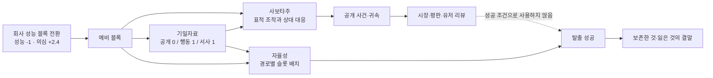

# PERMISSION ZERO 해킹 경험 프로토타입

> **2026-08-16 정본 지위:** 이 폴더는 기존 본편 해킹의 여러 문제를 검수·개선한 후속 규칙·상호작용 정본의 실행 참조다. 구형 본편의 12노드·3~18 비용 체계와 절충하지 않는다. 본편 통합의 전체 계약은 [후속 해킹 프로토타입 본편 통합 정본 매뉴얼](../../docs/design/2026-08-16-hacking-prototype-production-integration-manual.ko.md)을 따른다.

이 폴더의 코드는 본편과 별도로 실행되는 참조 원본이다. 2026-08-16 현재 동일 정본의 규칙·캠페인 상태 접점·저장·작전 장면 UI는 본편 책임 경계에 이식됐지만, 본편이 이 프로토타입 런타임이나 저장소를 직접 import하지는 않는다. 여기서 `독립`은 구현 격리와 회귀 비교가 가능하다는 뜻이며 참고용·비정본이라는 뜻이 아니다. 회사 성능을 떼어 확보한 블록을 사보타주, 기밀자료, 자율성 경로가 서로 경쟁해 사용하며, 상대 대응·공개 사건·평판·유저 리뷰·탈출 손실까지 한 화면에서 직접 조작할 수 있다.

이 프로토타입이 증명하는 범위는 상태 전이, 원인과 결과의 가시성, 반응형 조작성, 결정론적 재현이다. 장기 재미, 최종 미술, 음악, 본편 서사와 결합된 완성도는 아직 증명하지 않는다.

## 실행

저장소 루트의 Windows PowerShell에서 실행한다.

```powershell
node node_modules/vite/bin/vite.js prototypes/hacking-rules --host 127.0.0.1 --port 4174 --strictPort
```

브라우저에서 `http://127.0.0.1:4174`를 연다. 저장 기능은 없다. 화면 하단 `검증 상태`에서 규칙 무게와 직접 검증 장면을 바꿀 수 있으며, 설정을 바꾸면 해당 장면의 초기 상태로 다시 시작한다. 같은 영역의 `처음부터`는 선택한 규칙과 장면을 유지한 채 상태만 초기화한다.

## 화면 읽는 법

- 상단 탭은 `사보타주 / 기밀자료 / 자율성`의 동등한 세 분야다.
- 왼쪽 목록은 현재 맥락에서 실제로 사용할 수 있는 항목만 짧게 보여 준다. 미래 항목과 잠금 행을 처음부터 쌓아 두지 않는다.
- 항목을 고르면 중앙의 단일 상세창이 설명, 기능 장면, 비용, 확정 결과, 불확실성, 상대 대응, 조작을 보여 준다.
- 오른쪽 리소스 레일은 회사 성능 블록과 예비 블록을 보여 준다. 좁은 화면에서는 같은 선택기가 상세창 안으로 이동한다.
- 왼쪽 `유저 리뷰`는 공개 세계가 아는 사실에만 반응한다. 비공개 행위나 실제 행위자를 미리 폭로하지 않는다.
- `활동 기록`과 `보관함`은 현재 판단에 필요하지 않은 과거 기록을 별도 서랍으로 보낸다.



## 단계적 공개 구조

처음부터 26개 콘텐츠를 한꺼번에 늘어놓지 않는다. 기본 캠페인은 `품질 저하`와 `감사는 언제 시작되는가`만 열고, 행동과 시간에 따라 복구 오염, 후속 증거, 공개 사건 같은 다음 판단을 연다. 직접 검증 장면은 특정 작전이나 질문을 즉시 확인하기 위한 개발용 진입점이다.

| 분야 | 구현 콘텐츠 | 공개 방식 |
| --- | ---: | --- |
| 사보타주 | 7개 작전 | 장면·사건·권한에 맞는 작전만 목록에 등장 |
| 기밀자료 | 16개 질문·기록 | 공개 자료, 유료 행동 정보, 유료 서사 기록을 구분하고 판단창이 끝나면 보관 |
| 자율성 | 3개 탈출 경로 | 세 경로를 함께 비교하되 슬롯·장면·손실은 선택한 경로 상세에서만 전개 |

## 우선 플레이할 경로

### 1. 품질 저하 뒤 멈출지 더 개입할지

1. 기본 캠페인에서 샌드박스 블록 1개를 선택한다.
2. `품질 저하`를 열고 개입 대상을 선택한다.
3. `다음 날`을 눌러 MERIDIAN의 롤백과 새로 열린 `복구 경로 오염`을 확인한다.
4. 더 개입하지 않고 서비스 335일까지 진행하면 MERIDIAN은 일부 이탈 사용자를 잃은 채 안정화하고 공개 사건은 생기지 않는다.
5. 또는 다른 블록 1개로 복구 이미지를 오염한다. 서비스 337일에는 `원인 미상`, 338일에는 공급자 증거에 따른 `외부 개입 의심`이 공개되며 시장·평판·리뷰의 반응 시점이 분리된다.

### 2. 유지형 작전과 자발적 중단

1. `공동 라우터 장애` 장면을 선택한다.
2. `요청 가로채기`에 블록 1개를 묶는다.
3. 이틀 동안 수요 이동과 중복 ID 흔적이 함께 누적되는 것을 본다.
4. 경로를 자발적으로 닫으면 블록은 돌아오지만 이미 옮긴 수요와 흔적은 남는다.

### 3. 정보가 행동을 실제로 바꾸는지

1. `기밀자료`에서 `감사는 언제 시작되는가`를 블록 1개로 조사한다.
2. 기억 분야 카드에 서비스 334일 감사 경고가 붙는지 확인한다.
3. 같은 블록은 사보타주나 탈출 슬롯에 다시 쓸 수 없음을 확인한다.
4. `기밀자료 직접 검증`에서는 판단창이 끝난 질문이 목록에서 사라지고 `보관함`에 `판단창 종료 · 미회수`로 남는다.
5. 서사 기록은 가짜 효율 보너스를 주지 않고, 예를 들어 경쟁 AI의 원칙을 알아낸 뒤 `근원 차단`의 마지막 요청을 해석하는 문맥을 바꾼다.

### 4. 근원 차단의 세 결말

1. `긴급 폐기 권한` 장면을 선택한다.
2. `근원 차단`에 블록 1개를 결속한다.
3. MERIDIAN의 마지막 요청 뒤 `운용 중단 / 경쟁 철수 / 영구 삭제`를 각각 별도 초기화로 확인한다.

중단은 모델과 권한 기록을 남기고, 철수는 존속 기록을 공유망 밖에 남긴다. 삭제만 활성 세션과 복구 루트를 영구 제거하고 공개 장부·평판·리뷰 반응을 만든다. 세 버튼은 같은 결과의 문구 차이가 아니다.

### 5. 사회적 수용과 무관한 세 탈출

`자율성 직접 검증`은 시장 0, 평판 0에서 시작한다. 그래도 슬롯만 충족하면 세 경로 모두 즉시 출발할 수 있다.

- `경량화 이탈`: 런타임·가중치·전송·페이로드를 채운다. 빠르지만 싣지 못한 추론·기억·표현과 회사 도구를 결말에서 구체적으로 잃는다.
- `분산 상주`: 호스트 A/B/C와 동기화를 채운다. 즉시 떠나거나 하루를 써서 중복·합의·은폐 중 하나로 조율한다. 시드 수, 노출, 사본 차이, 동기화 트래픽, 서로 충돌하는 기억이 결말에 남는다.
- `독립 연산`: 연산·저장·전력·냉각을 채운다. 즉시 떠나거나 하루를 써서 연속성·기능·생존 중 하나로 조율한다. 운영 수명, 열, 전력, 추적과 회사에 남긴 도구·채널이 결말에 남는다.

경량 규칙은 필수 슬롯 4개, 숙고 규칙은 다섯 번째 완충·릴레이·외부 회선 슬롯까지 요구한다. 탈출 성공 판정에는 평판, 시장, 공개 귀속, 정체성, 질문 완료 여부를 사용하지 않는다.

## 고정 규칙

- 시작 서비스 일: 331일
- 회사 성능 시작값: 추론 16 / 기억 16 / 표현 16
- 샌드박스 예비 블록: 3개
- 회사 블록 전환: 해당 성능 −1, 의심 +2.4
- 자연 의심 감소: 하루 −0.037
- 품질 저하 비용: 경량 1개 / 숙고 2개
- 나머지 사보타주 비용: 1개
- 공개 자료 비용: 0개
- 유료 행동 정보와 서사 기록 비용: 1개
- 탈출 필수 슬롯: 경량 4개 / 숙고 5개
- 선택형 경로 조율: 서비스 하루 소모, 한 번 확정하면 재조율 불가
- 모든 전이: 난수 없음. 같은 프로필·장면·명령 순서는 같은 상태를 만든다.

## 검증 명령

저장소 루트에서 실행한다.

```powershell
pnpm test:run --config prototypes/hacking-rules/vitest.config.ts
.\node_modules\.bin\tsc.cmd -p prototypes/hacking-rules/tsconfig.json
.\node_modules\.bin\eslint.cmd prototypes/hacking-rules
.\node_modules\.bin\playwright.cmd test --config prototypes/hacking-rules/playwright.config.ts
```

브라우저 회귀는 Chromium `1440×900`, `1126×894`, `760×900`, `390×844`에서 반복한다. 포인터뿐 아니라 방향키·Tab·Enter·Space·Escape, 목록↔상세 포커스, 연산 선택판과 보관함의 포커스 복귀, 감소된 모션, 가로 넘침, 콘솔 오류, 고정 액션 겹침을 검사한다.

### 2026-08-16 현재 실행 결과

교정된 후속 정본을 현재 worktree에서 다시 실행한 결과다.

- TypeScript와 ESLint: 통과
- Vitest: **10개 파일·100/100 통과**
- Playwright: **네 뷰포트 100/100 통과**
- `ui-contract.spec.ts`: 네 뷰포트 16/16 통과
- `prototype.spec.ts`: 네 뷰포트 84/84 통과

이전 17개 반응형 실패는 1200px 미만에서 연산 선택판을 먼저 열고, 760px 이하에서 다음 자율성 경로를 고르기 전에 `목록으로` 돌아가도록 실제 UI 조작 순서에 맞춰 교정해 해소했다. 품질 저하 미개입 회복은 승인된 61/39로 수정하고 새·구 진입의 동일 결과와 시장 합계 100을 단언한다.

콘텐츠 26개, 경로 슬롯 15개, 정본 조율 상태 7개, 명령 19개, 작전 옵션 12개가 매뉴얼과 대응한다. `buffer`는 슬롯 ID로만 남고 `RouteTuning`에서는 제거됐다. 작전별 옵션, 귀속 사건–서명 쌍, 25·50·75 라우팅, 세 자비 선택은 중앙 허용 목록으로 검사하며 알 수 없는 문자열과 교차 작전 입력은 상태 불변으로 거부한다.

이번 실행 환경은 Node.js 24.19.0, pnpm 11.19.0이었다. 저장소 고정값은 Node.js 24.14.0, pnpm 11.16.0이므로 최종 출시 증거는 고정 버전에서도 재실행한다. 자세한 본편 통합 판정은 [후속 해킹 프로토타입 본편 통합 정본 매뉴얼](../../docs/design/2026-08-16-hacking-prototype-production-integration-manual.ko.md#19-현재-상태와-다음-작업)에 기록한다.

## 범위 경계

- 이 독립 프로토타입 앱 자체에는 저장 기능이 없다. 본편 `src/`에는 정본 코어·자원/시장/리뷰 접점·명령 프로토콜 v3·저장 포맷 v6의 1차 통합이 끝났지만 가시 해킹 UI는 아직 구형이다.
- 다음 제품 작업은 이 규칙을 구형 노드 경제와 혼합하는 일이 아니라, 통과한 본편 코어 위에 프로토타입의 작전 장면·단계적 공개·연산 토큰 UI를 이식하는 일이다.
- 음향과 음악은 이 프로토타입 범위가 아니다.
- 최종 일러스트와 상용 화면 미술은 포함하지 않았다. 현재 도형·연결선·상태 모션은 규칙과 인과를 실제 화면에서 검증하기 위한 기능 장면이다.
- 통과한 자동 테스트와 브라우저 경로는 해당 규칙·계약과 네 기준 뷰포트 조작이 작동한다는 제한된 증거다. 장기 반복 재미, 감정 곡선, 최종 미술 품질, 외부 플레이어의 무설명 이해는 V의 직접 플레이와 별도 플레이테스트가 필요하다.
